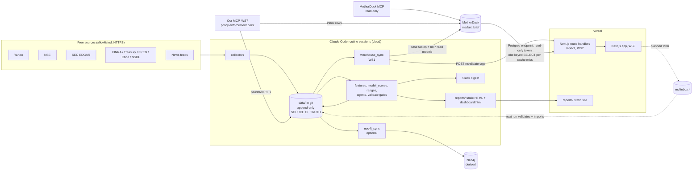

# Architecture: the app around the pipeline (wave 0 contract)

Status: contract for waves 1-3 (2026-10-07). It adds an app (API, frontend, governed actions) around
the existing daily pipeline (docs/DESIGN.md) and changes none of it. Research only: nothing here places
or suggests a trade, and nothing connects to a broker.

Companion files: `api/openapi.yaml` (the HTTP contract and the read-model payload schemas),
`tests/test_openapi.py` (its offline checks), `docs/ws/README.md` (workstream notes).

## 1. Decisions in one table

| Question | Decision |
|---|---|
| Source of truth | `data/` in git, append-only (unchanged). Everything else is derived and rebuildable. |
| Warehouse | MotherDuck database `market_brief` (Lite plan): a derived copy of `data/` plus precomputed read models. |
| What the app reads | Only the read models: one keyed `SELECT payload` per page. No joins, no aggregation at request time. |
| Who computes | The routine sessions (Python, DuckDB), after each daily run and each news run. Never the API. |
| API | Next.js route handlers on Vercel under `/api/v1`, reading MotherDuck through its Postgres endpoint. |
| Caching | Vercel data cache, tagged per read-model key, invalidated on demand by the sync; `built_at` is the ETag. |
| Auth | Vercel Authentication (deployment protection) now. OAuth only when the remote MCP endpoint goes live. |
| Writes from people | Slack / Claude Code -> validated CLIs -> `data/` (WS4). Dashboard form later -> append-only inbox table -> imported into `data/` by the next run. |
| Ad-hoc questions | MotherDuck's official MCP, read-only token. |
| Governed actions | Our own thin MCP (wave 2, WS7) as the policy enforcement point. |
| Degraded mode | MotherDuck down or capped: static `reports/` and the Slack digest still work; the app shows "data service unavailable" with links to them. |

## 2. Components and data flow



ASCII summary of the critical path:

```
sources -> collectors -> data/ (git) -> pipeline -> reports/ + Slack          (unchanged, always works)
                              \-> warehouse_sync -> MotherDuck rm.* -> /api/v1 (cached) -> app
```

## 3. Source of truth vs derived stores

| Store | Role | Rebuild | Lose it and... |
|---|---|---|---|
| `data/<market>/` (git) | Canonical records, append-only, `validate.py`-gated | n/a | (never: git history) |
| MotherDuck `market_brief`, schema `base` | Typed copy of each data kind, same columns as `core/schemas.py`, plus the `sql/views.sql` views (those that run in MotherDuck; WS1 decides) | `warehouse_sync --full` from the repo (flag names proposed; WS1 owns the CLI) | rebuild, ~minutes |
| MotherDuck schema `rm` | Read models: per-page JSON payloads as of a cut-off | `warehouse_sync --rebuild-rm` from `base` (or from the local DuckDB) | rebuild; app shows degraded mode meanwhile |
| MotherDuck schema `inbox` (planned) | Unimported form entries only (not derived!) | not rebuildable | lose un-imported entries; UI tells the user they were pending (section 9) |
| Neo4j | Graph copy (DESIGN.md section 12) | `neo4j_sync --full` | rebuild |
| `reports/` | Static HTML reports and `dashboard.html`, served by the owner's private Vercel site | rerun the report steps | regenerate |

Rule: no store but `data/` (and, transiently, `inbox`) holds a fact that is not derivable from `data/`
plus `config/`. A read model never contains a number the pipeline did not store or compute
deterministically from stored rows.

## 4. The read-model contract (WS1 implements, WS2 reads)

### 4.1 Tables

Schema `rm`, one table per page type, identical columns in every table:

| Column | Type | Meaning |
|---|---|---|
| `market` | VARCHAR | `india` or `us` (`_all` for cross-market pages) |
| `page_key` | VARCHAR | `_` for market-level pages; the ticker for per-stock pages |
| `as_of` | DATE | The newest indicator snapshot date stored by the cut-off (`reads.as_of_date`); null when none |
| `cutoff` | TIMESTAMPTZ | The data cut-off the payload was built at: the run's clock (`MB_NOW`-aware). Every input row was stored at or before it |
| `built_at` | TIMESTAMPTZ | When this payload first took its current value (unchanged by a rebuild that produces the same payload, 4.4) |
| `schema_version` | VARCHAR | The `info.version` of `api/openapi.yaml` the payload conforms to, e.g. `1.0.0` |
| `source_commit` | VARCHAR | The git commit of `data/` the build read (`git rev-parse HEAD` before the sync) |
| `payload_sha256` | VARCHAR | SHA-256 of the canonical payload JSON (sorted keys, no whitespace) |
| `payload` | JSON | The page body; its schema is the matching component in `api/openapi.yaml` |

Primary key `(market, page_key)`. One current row per key. Each `rm` table is small (at most
2 markets x 21 keys: `rm.news` has `_` plus 20 tickers), so a keyed lookup is a scan of a few dozen rows.

| Table | page_key | Payload schema (`api/openapi.yaml`) | Serves | Built from (existing code) |
|---|---|---|---|---|
| `rm.markets` | `_` (market `_all`) | `MarketList` | `GET /api/v1/markets` | market configs + `rm.status` rows |
| `rm.status` | `_` | `MarketStatus` | `GET /api/v1/markets/{market}/status` | `market_status.status`, `news_runs`, `rm.builds`, features `computed_at` |
| `rm.overview` | `_` | `Overview` | `GET /api/v1/markets/{market}/overview` | `dashboard/assemble.gather_dashboard` head + `market.overview` + `model_info.skill_status`; signal tiers from WS4 (planned) |
| `rm.watchlist` | `_` | `Watchlist` | `GET /api/v1/markets/{market}/watchlist` | per-company slices of `assemble.company` |
| `rm.stock` | ticker | `StockDetail` | `GET /api/v1/markets/{market}/stocks/{ticker}` | `assemble.company` minus `bars`, plus events |
| `rm.bars` | ticker | `Bars` | `GET /api/v1/markets/{market}/stocks/{ticker}/bars` | `stock.bar_rows` + `stock.range_rows` |
| `rm.track_record` | `_` | `TrackRecord` | `GET /api/v1/markets/{market}/track-record` | `track.track_record`, `model_info.backtest_view`, `skill_status` |
| `rm.news` | `_` and ticker | `NewsFeed` | `GET /api/v1/markets/{market}/news[?ticker=]` | `reads.news` + `EvidenceStatuses` + `news_enriched` as of the cut-off |
| `rm.runs` | `_` | `RunList` | `GET /api/v1/markets/{market}/runs` | `news_runs`, `rm.builds` |
| `rm.portfolio` (planned, WS4) | `_` | `PaperPortfolio` | `GET /api/v1/markets/{market}/portfolio` | WS4's paper-portfolio data kinds |

Plus one bookkeeping table (not a page): `rm.builds` (`build_id`, `market`, `kind` = daily|news|full,
`cutoff`, `source_commit`, `started_at`, `finished_at`, `ok`, `pages_written`, `pages_unchanged`,
`error`), append-only.

The payload is the response body's `payload` field verbatim; the route handler adds nothing but the
metadata columns (`ReadModelMeta` in the spec). WS1 validates every payload against its schema before
writing (a `jsonschema`-free check is fine: required keys and types from the YAML), and a failed page
is not written (the old row stays, the build row records the error).

### 4.2 Reuse, not reimplementation

The dashboard already assembles every page body from stored data as of a cut-off
(`scripts/marketbrief/presentation/dashboard/`). WS1 calls those functions with the run's clock and
slices the result per page; field names in the spec are those of the dashboard payload, the schemas in
`core/schemas.py` and the views in `sql/views.sql`. Fields the dashboard does not yet emit but stored
data supplies (company events, news enrichment, news runs) are read with the same as-of rules. Fields
nothing stores yet carry `x-status: planned` in the spec and are omitted from payloads until built.

### 4.3 as_of and no look-ahead

1. **One cut-off per build.** The sync takes `cutoff` = the run's clock (`core.clock.clock()`, so a
   replay with `MB_NOW` builds what was known then). Every query filters on the row's own storage time
   (`computed_at`, `made_at`, `first_seen_at`, `collected_at`, `written_at`, `scored_at`,
   `analyzed_at`, `fitted_at`, `as_of` of status rows) `<= cutoff`, exactly as `dashboard/reads.py`
   does, and bars stop at `as_of`.
2. **No "latest" views without a cut-off.** Views such as `enriched_latest`, `company_events` or
   `review_latest` are not as-of; read models use the cut-off variants (`news_verified_asof(ts)`,
   `news_status_ids_asof(ts)`, `earnings_estimates_asof(ts)`, `fundamentals_*_asof(ts)`, or the
   `reads.py` pattern `DISTINCT ON ... WHERE <stored_at> <= cutoff`).
3. **The API never computes from base tables.** It returns the stored payload; the only request-time
   arithmetic is the freshness age (`now - built_at`), which is presentation, not data.
4. **History, if ever needed**, is a rebuild with `MB_NOW` into a separate schema (`rm_replay`), never
   a mix of cut-offs in `rm`.
5. **A late run stays late.** Ranges and calls keep their `late` flags from `stock.range_rows` /
   `score_predictions.is_late`; the app shows them as "late, not a forecast".

### 4.4 Idempotent rebuilds

- A build computes every payload in memory, canonicalises it (sorted keys, floats as the pipeline
  rounded them) and hashes it.
- Upsert per `(market, page_key)`: if `payload_sha256` equals the stored one, the row is left alone
  (`built_at` unchanged, counted as `pages_unchanged`); otherwise it is replaced with `built_at` = now.
  The cut-off changes every run, so `cutoff` is excluded from the hash, otherwise nothing would ever
  be unchanged. Payload fields that are a cut-off (e.g. `generated_at`) are excluded too: the payload
  carries `as_of`, and the envelope carries `cutoff`.
- All writes of one build run in one transaction (`BEGIN; ... COMMIT;`), so a reader sees the whole
  old or the whole new set, never a mix.
- Running the same build twice on the same commit writes nothing the second time and invalidates no
  cache. `--rebuild-rm` (drop and refill `rm`) gives the same payloads and hashes as an incremental build.
- Rows for keys that left the watchlist are deleted in the same transaction.

### 4.5 Base tables

`base.<kind>` mirrors `data/<market>/<kind>/` with the column types of `core/schemas.py` plus a
`market` column; incremental by per-kind watermark on the kind's storage-time column (pattern of
`marketbrief/graph/neo4j/sync.py`), `--full` rebuilds. `base` exists for the read-only MotherDuck MCP
and for building `rm` from MotherDuck when the local checkout is not at hand; the app never reads it.

## 5. Sync cadence and compute budget

| Trigger | Work | Pages touched |
|---|---|---|
| Daily run (routine step after `dashboard`, non-blocking, consolidation wires it) | base incremental for all kinds; rebuild every `rm` page of the market | all 66 per market (+1 `rm.markets`), most change |
| News run (every 4 hours, after its push) | base incremental for news kinds; rebuild `rm.news`, `rm.stock` (news section), `rm.status`, `rm.runs`, `rm.markets` | 43 per market (+1), most unchanged by hash |
| `--full` (manual) | drop and refill | all |

Budget against the Lite cap of 10 compute-hours per month. Assumptions (A) and unknowns (U):

- A1: ~22 sessions per market per month, so 44 daily syncs.
- A2: news runs every 4 hours, 5 runs per market per day (live crons: India 06:17, 10:17, 14:17, 18:17, 22:17 UTC;
  US 00:47, 04:47, 08:47, 16:47, 20:47 UTC) = 5 x 2 markets x 30 days = 300 news syncs.
- A3: an incremental daily sync runs ~60 s of MotherDuck compute (appends of a few hundred rows plus
  ~67 small upserts: 6 market-level pages + 3 x 20 per-ticker pages + `rm.markets`), a news sync ~15 s. To be measured in week 1.
- A4: the app is used by one person; ~50 page views per day, of which, with tag-based caching, at most
  one cache miss per changed key per build reaches MotherDuck: ~30 misses per day, ~900 per month.
- U1: MotherDuck's per-query minimum billing and how long an instance stays billed after the last
  query (idle cool-down). **Verify in week 1 from the MotherDuck usage page.**
- U2: whether the Postgres endpoint bills differently from the native client. **Verify in week 1.**
- U3: whether a full rebuild (~all kinds, both markets) fits in a few minutes. **Measure in week 1.**

Arithmetic: news 300 x 15 s = 4500 s = 1.25 h; wakes 300 x 60 s = 5.00 h; daily 44 x 60 s = 0.73 h; reads 900 x 1 s = 0.25 h;
full rebuilds 2 x 10 min = 0.33 h. Column 1: 0.73 + 1.25 + 0.25 + 0.33 = 2.56 (~2.6). Column 2, warmed: 0.73 + 0.73 + 1.25 + 5.00 + 0.25 + 0.33 = 8.29 (~8.3);
plus up to 15.0 h of read wakes = 23.29 (~23).

| Item | Count / month | Per item | Hours (U1 = 1 s min, no cool-down) | Hours (U1 = 60 s cool-down per wake) |
|---|---|---|---|---|
| Daily syncs | 44 | 60 s | 0.73 | 0.73 + 0.73 |
| News syncs | 300 | 15 s | 1.25 | 1.25 + 5.00 |
| Read misses | 900 | 1 s | 0.25 | up to 15.0 if each miss wakes the instance |
| Full rebuilds | 2 | 10 min | 0.33 | 0.33 |
| **Total** | | | **~2.6** | **~8.3 (reads warmed by the sync) to ~23 (every miss wakes it): the low case is near the cap** |

So the design holds under per-second billing and fails under a long per-wake cool-down. Guards:

1. Reads are cached until invalidated (no time-based revalidate below 24 h), so misses happen only
   after a build changed a key: worst case 67 keys x 344 builds, realistic far fewer (news runs change
   few keys; hash-unchanged rows invalidate nothing).
2. If week 1 shows a long cool-down: (a) news syncs drop to every other news run or batch both
   markets into one connection; (b) the sync also writes each payload to a Vercel-side JSON cache
   (re-warm by calling the revalidate endpoint, which fetches once while the instance is still warm
   from the sync); (c) news runs stop touching MotherDuck and only the daily sync does.
3. Kill switch: `config/warehouse.yaml` (WS1) carries `enabled` and a monthly hours ceiling (default 7);
   the sync reads MotherDuck's usage where available and skips (non-blocking, logged in `rm.builds`)
   above it. The app then serves cached payloads and, on a miss, degraded mode.

## 6. API layer (WS2)

- Next.js route handlers (`app/api/v1/.../route.ts`), Node runtime (the `pg` driver needs TCP).
- Connection: MotherDuck Postgres endpoint `pg.eu-central-1-aws.motherduck.com:5432`, user `postgres`,
  password = token, database `market_brief`, `sslmode=verify-full`. A read-only (read-scaling) token
  where MotherDuck offers one for this endpoint; otherwise a dedicated token used only by Vercel.
- One parameterised statement per request, nothing else:
  `SELECT market, page_key, as_of, cutoff, built_at, schema_version, source_commit, payload_sha256, payload FROM rm.<table> WHERE market = $1 AND page_key = $2`.
  The table name comes from a fixed route-to-table map, never from input. `market` is validated
  against `india|us`, `ticker` against `^[A-Z0-9.&-]{1,20}$` and the market's watchlist (the
  `rm.watchlist` payload, cached) before querying.
- Pool size 1, statement timeout 5 s, no retries inside a request (fail to degraded mode).
- Response: `ReadModelMeta` fields plus `payload` (see the spec). `ETag` = `"<payload_sha256>"`,
  `Last-Modified` = `built_at`. 404 for an unknown key, 503 with `Problem` for MotherDuck errors.
- The spec's `x-status: planned` operations return 501 until built.

## 7. Caching and auth

- **Cache**: each handler fetches through Next's data cache with tag `rm:<table>:<market>:<page_key>`
  and `revalidate: 86400` (a daily safety net only). After a build commits, the sync calls
  `POST /api/v1/internal/revalidate` with the keys whose `payload_sha256` changed; the handler calls
  `revalidateTag` for each. Unchanged pages keep their cache across builds, so opening the dashboard
  many times a day costs no MotherDuck compute. Browsers get `Cache-Control: private, no-cache` plus
  the ETag (a 304 costs no query: the handler compares against the cached payload).
- **Auth now**: Vercel Authentication on all deployments (as for `reports/` today). The sync reaches
  the revalidate endpoint with Vercel's protection-bypass header and a shared secret.
- **Auth later**: OAuth (the MCP authorization spec) only when the remote MCP endpoint (WS7) is
  exposed beyond Vercel Authentication.

## 8. Secrets

Environment variables only; never in code, URLs, logs, commits, PR text or Slack. Summaries print the
host only (as `neo4j_sync` does).

| Variable | Where | Scope |
|---|---|---|
| `MOTHERDUCK_TOKEN` | cloud routine sessions | read-write: sync, inbox import |
| `MOTHERDUCK_READ_TOKEN` | Vercel (server env, not `NEXT_PUBLIC_`) | read-only where available |
| `MOTHERDUCK_INBOX_TOKEN` | Vercel (both projects), cloud sessions, GitHub Actions secret | writes `market_brief_inbox` only (separate service account; `mcp/inbox.sql`) |
| `GITHUB_DISPATCH_TOKEN` | Vercel | fine-grained, this repo only, Actions read and write: dispatches `onboard.yml` |
| `SLACK_SIGNING_SECRET` | Vercel gateway | Slack request verification (`SLACK_BOT_TOKEN` unchanged) |
| `GITHUB_OAUTH_CLIENT_ID`, `GITHUB_OAUTH_CLIENT_SECRET`, `MCP_ALLOWED_GITHUB_LOGIN`, `MB_OWNER_GITHUB_ID`, `SESSION_SECRET` | Vercel gateway | `/mcp` sign-in (GitHub OAuth, the owner's login and numeric id) and its signed tokens |
| `MB_GATEWAY` | Vercel gateway | gateway mode (`market-brief-gateway`); unset in `market-brief-app` |
| `REVALIDATE_SECRET` | both | the revalidate endpoint |
| `VERCEL_AUTOMATION_BYPASS_SECRET` | cloud sessions | pass Vercel Authentication for the revalidate call |
| `SLACK_*`, `NEO4J_*` | unchanged | unchanged |

Separate tokens per consumer, so a leaked Vercel token cannot write and either can be revoked alone.

## 9. User-entered records

Decision: `data/` in git is canonical for user records too (paper trades, holdings, add-company
requests), each its own data kind with a schema in `core/schema_*.py` (WS4 for portfolio).

1. **Now: Slack or Claude Code -> validated CLI.** E.g. `python scripts/portfolio.py add ...` (WS4)
   validates (schema, ticker on the watchlist, price from stored bars, idempotency key not seen
   before) and appends via `work/` + `cat >>` as Data rule 2 requires; the session commits and pushes.
2. **Later: dashboard form -> `inbox.<kind>` in MotherDuck** (append-only, `inbox_id` = the client's
   Idempotency-Key, `submitted_at`, `submitted_by` injected from the Vercel Authentication identity,
   never from the body). The next run imports: same CLI validation, append to `data/`, and a
   `command_log` row per inbox id (result accepted, refused, duplicate or failed, with the reason); company
   commands are read from `market_brief_inbox`, table `inbox.company_commands` (docs/ws/b1.md, "Contract"). The
   import is idempotent because an inbox id with a settled `command_log` row (accepted, refused, duplicate) is
   skipped and an all-`failed` one is retried; a rebuild never replays the inbox.
3. Until imported, the app shows the entry as "pending (not yet in the record)", never as a fact.

Why not alternatives: writing straight to git from Vercel needs a repo-write token in the web tier
and races the routines' pushes; writing straight into `base` would make the derived copy diverge from
the repo. The inbox keeps Vercel's write power to one append-only table, keeps every validation in
Python next to the data rules, and costs one tiny write per entry. The one weakness (inbox loss before
import) is bounded to entries since the last run and visible as pending.

## 10. MCP and agent governance (WS7)

- **Ad hoc**: MotherDuck's official MCP server with `MOTHERDUCK_READ_TOKEN`, read-only (no writes,
  no attach of other databases). Answers are research only and cite tables and cut-offs.
- **Governed actions**: our own thin MCP server (`mcp/`, WS7), following the agentic-commerce pattern:
  1. One definition per agent (`mcp/agents/<agent>.yaml`): allowed tools, per-day action budget, kill
     switch (`enabled: false` stops every call), and the human to fail to.
  2. The MCP server is the policy enforcement point: every call is checked against the agent's
     definition before it reaches a CLI; tools are thin wrappers over the same validated CLIs as 9.1.
  3. Identity is injected by code (the server's own auth context), never taken from tool arguments
     or prompt text.
  4. Every write tool requires an idempotency key; a repeated key returns the first result.
  5. Fail safe to a human: anything ambiguous, over budget or failing validation returns a refusal
     and a Slack message to the owner; nothing is retried by the agent.
  6. Evals plus a prompt-injection suite (instructions hidden in news titles, filings, Slack text)
     run offline in CI; a release needs them green.

  Built in Wave 2 by session B5 (docs/ws/b5.md): the agent files `mcp/agents/*.yaml`, the policy enforcement point
  `web/lib/tools/executor.ts`, the injection suite `web/lib/tools/tests/injection.test.ts` (CI `web-tests.yml`).
  The remote MCP endpoint is `/mcp` on the gateway deployment with GitHub OAuth (SPEC decision 22).
- No tool can place, route or simulate a broker order; paper trades are records only.

## 11. Failure modes

| Failure | Effect | Handling |
|---|---|---|
| MotherDuck down | API misses fail | 503 `Problem` with links to `reports/<market>/dashboard.html` and the latest report; cached pages still served; daily run, reports and Slack unaffected (sync is non-blocking) |
| Compute cap reached | Same as down until month end | Kill switch skips syncs (5, guard 3); app shows "data as of <built_at>" from cache |
| Sync fails mid-way | Transaction rolls back | Old read models stay; `rm.builds.ok = false`; status page shows stale age |
| Stale data (no build for > 1 trading day) | Old payloads | `MarketStatus.freshness.state = stale`; the UI banner says so |
| Schema drift (payload vs spec) | Bad page | WS1 validates before writing; `schema_version` lets WS2/WS3 refuse an unknown major version |
| Bad token / leaked token | Unauthorized or misuse | Separate tokens, revoke one; no token ever in client bundles |
| Vercel down | No app | Slack digest and its attached HTML still work |
| Inbox loss | Pending form entries lost | Visible as pending; re-enter; canonical data unaffected |

## 12. Workstream ownership

| Wave | WS | Owns | Builds against |
|---|---|---|---|
| 0 | wave0 | `docs/ARCHITECTURE.md`, `api/openapi.yaml`, `tests/test_openapi.py`, `docs/ws/README.md` | - |
| 1 | WS1 warehouse | `scripts/marketbrief/warehouse/`, `scripts/warehouse_sync.py`, `config/warehouse.yaml`, `tests/test_warehouse*.py`, `docs/ws/ws1.md` | section 4, spec payload schemas |
| 1 | WS4 portfolio + signal tiers | `scripts/marketbrief/portfolio/`, `scripts/portfolio.py`, `config/portfolio.yaml`, `core/schema_portfolio.py`, `tests/test_portfolio*.py`, `docs/ws/ws4.md` | `PaperPortfolio`, `SignalTiers`, section 9 |
| 1 | WS5 intraday | `scripts/marketbrief/intraday/`, `scripts/intraday_check.py`, `config/intraday.yaml`, `core/schema_intraday.py`, `.claude/agents/deviation-explainer.md`, `routine/INTRADAY_PROMPT.md`, `tests/test_intraday*.py`, `docs/ws/ws5.md` | adds a read model later (spec bump) |
| 1 | WS6 results | `scripts/marketbrief/results/`, `scripts/results_digest.py`, `config/results.yaml`, `core/schema_results.py`, `.claude/agents/results-analyst.md`, `routine/RESULTS_PROMPT.md`, `tests/test_results*.py`, `docs/ws/ws6.md` | adds a read model later (spec bump) |
| 2 | WS2 API | `api/` (spec changes via minor version bump), `app/api/` (route handlers), its tests, `docs/ws/ws2.md` | sections 6-8, the spec |
| 2 | WS7 MCP + governance | `mcp/` (server, agent definitions, evals, injection suite), `docs/ws/ws7.md` | section 10 |
| 2 | WS8 alerts | `scripts/marketbrief/alerts/`, `scripts/alerts.py`, `config/alerts.yaml`, `tests/test_alerts*.py`, `docs/ws/ws8.md` | read models + Slack; never trade signals beyond the paper label |
| 1 (waves of SPEC section 10) | W1 catalogue | `docs/DATA_CATALOGUE.md`, `design/catalogue/`, `mcp/tools.yaml`, `core/schema_lab.py`, `core/schema_lifecycle.py`, `config/strategies.yaml`, `marketbrief/contracts/`, `docs/ws/w1.md` | SPEC sections 3-4 |
| 2 (waves of SPEC section 10) | B3 AI traders | `marketbrief/traders/`, `.claude/agents/trader-*.md`, `forecaster.md`, `eod-analyst.md`, `research-director.md`, `routine/POSTCLOSE_PROMPT.md`, `routine/WEEKLY_PROMPT.md`, `docs/ws/b3.md` | SPEC F4, F6 |
| 2 (waves of SPEC section 10) | B9 monitoring | `marketbrief/intraday/` (`trades.py`, `trade_rows.py`, `alerts.py`), `core/schema_intraday.py` (`trade_check_details`, `intraday_alerts`), `sql/views.sql` B9 block, `config/intraday.yaml`, `routine/INTRADAY_PROMPT.md` | SPEC F5; docs/ws/b9.md |
| 3 | WS3 frontend | `app/` except `app/api/`, frontend tests, `docs/ws/ws3.md` | the spec only (never MotherDuck directly) |
| 3 | consolidation | shared docs, routine prompts, wiring steps into the routine, end-to-end run of both markets | everything |

Shared files follow the additive rules of the wave plan (one import + one spread line in
`core/schemas.py`, WS-marked constant blocks, `sql/views.sql` blocks appended at the end). Spec changes
after wave 0: additive fields bump the minor version; renames or removals bump the major version and
need the owner's sign-off.
