# Market brief: India (NSE), 2026-10-05

_Research log, not investment advice. Generated by a scheduled Claude Code routine._

## Headline
Late run (after the Oct 5 close): no calls today. With the RBI decision due Oct 7 (poll: +25 bp hike, e7906fafc8773989), the main stock stories are the HDFC Bank CEO appointment and the insurers' hit from IRDAI's proposed commission caps.

## Yesterday
First live run: no ranges or calls have matured yet. The latest stored bar is Oct 1 (Oct 2 was a holiday). Oct 5 snapshot: Nifty 50 at 22,555.75 (+0.6%) ended a four-day losing streak, led by ICICI Bank and Reliance (ac2d6aae27eda39d). HDFC Bank opened ~2% higher on its CEO news, then reversed on rate-hike fears (398c0ded37caf25e). Insurers fell on the IRDAI commission-cap proposal (1f1fd6f003ff4e47), and pharma fell for a third day (9e91d467d35a97c4).

### Ranges scored (target date –)

No ranges have matured yet.

_none_

### Calls scored

_none_

## Today (2026-10-05)

**Regime: CALM** · India VIX 14.71 (+1.7%) · benchmark 5d -2.8% · benchmark 10d vol 12.4%

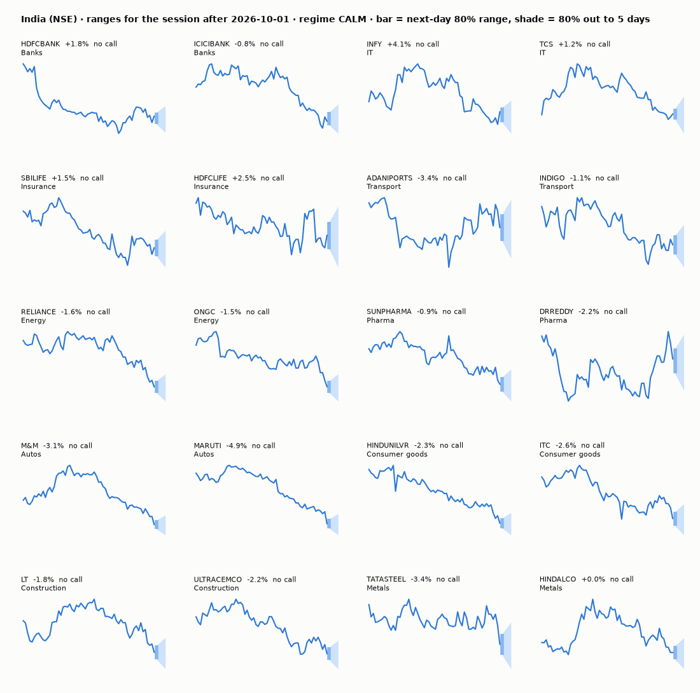

| Ticker | Sector | Close | Next day 80% | Next day 50% | 5 days 80% | Call | Cue | Notes |
|---|---|---|---|---|---|---|---|---|
| HDFCBANK | Banks | ₹721.20 | ₹705.17–₹728.65 | ₹711.14–₹722.15 | ₹689.22–₹741.89 | no call | -1.14% | cue -1.14% x0.5 |
| ICICIBANK | Banks | ₹1,310.60 | ₹1,300.05–₹1,334.75 | ₹1,308.90–₹1,325.17 | ₹1,278.03–₹1,356.02 | no call | +1.35% | cue +1.35% x0.5 |
| INFY | IT | ₹1,035.00 | ₹1,000.97–₹1,048.88 | ₹1,013.09–₹1,035.56 | ₹964.72–₹1,071.64 | no call | -2.72% | cue -2.72% x0.5 |
| TCS | IT | ₹2,075.00 | ₹2,033.39–₹2,115.63 | ₹2,054.25–₹2,092.82 | ₹1,920.61–₹2,217.48 | no call | – | earnings in horizon (x3.0 day) |
| SBILIFE | Insurance | ₹1,721.60 | ₹1,689.55–₹1,752.84 | ₹1,705.63–₹1,735.31 | ₹1,646.71–₹1,788.64 | no call | – |  |
| HDFCLIFE | Insurance | ₹534.20 | ₹519.90–₹548.26 | ₹527.06–₹540.35 | ₹500.96–₹564.51 | no call | – |  |
| ADANIPORTS | Transport | ₹1,737.80 | ₹1,689.33–₹1,785.50 | ₹1,713.58–₹1,758.67 | ₹1,625.25–₹1,840.68 | no call | – |  |
| INDIGO | Transport | ₹4,929.90 | ₹4,833.32–₹5,024.14 | ₹4,881.75–₹4,971.23 | ₹4,704.36–₹5,132.24 | no call | – |  |
| RELIANCE | Energy | ₹1,167.70 | ₹1,149.23–₹1,185.65 | ₹1,158.50–₹1,175.58 | ₹1,124.46–₹1,206.17 | no call | – |  |
| ONGC | Energy | ₹222.37 | ₹219.03–₹225.62 | ₹220.71–₹223.80 | ₹214.54–₹229.32 | no call | – |  |
| SUNPHARMA | Pharma | ₹1,801.00 | ₹1,773.57–₹1,827.65 | ₹1,787.34–₹1,812.70 | ₹1,736.75–₹1,858.08 | no call | – |  |
| DRREDDY | Pharma | ₹1,206.20 | ₹1,181.89–₹1,223.55 | ₹1,192.48–₹1,212.01 | ₹1,153.64–₹1,247.07 | no call | -0.53% | cue -0.53% x0.5 |
| M&M | Autos | ₹2,860.00 | ₹2,810.68–₹2,908.01 | ₹2,835.43–₹2,881.07 | ₹2,744.64–₹2,962.95 | no call | – |  |
| MARUTI | Autos | ₹11,386.00 | ₹11,152.10–₹11,614.45 | ₹11,269.36–₹11,486.17 | ₹10,840.14–₹11,876.77 | no call | – |  |
| HINDUNILVR | Consumer goods | ₹1,836.00 | ₹1,806.41–₹1,864.78 | ₹1,821.26–₹1,848.63 | ₹1,766.73–₹1,897.66 | no call | – |  |
| ITC | Consumer goods | ₹255.90 | ₹251.52–₹260.16 | ₹253.72–₹257.77 | ₹245.65–₹265.04 | no call | – |  |
| LT | Construction | ₹3,693.40 | ₹3,636.82–₹3,748.37 | ₹3,665.22–₹3,717.54 | ₹3,560.88–₹3,811.15 | no call | – |  |
| ULTRACEMCO | Construction | ₹10,710.00 | ₹10,534.89–₹10,880.32 | ₹10,622.77–₹10,784.77 | ₹10,300.15–₹11,075.04 | no call | – |  |
| TATASTEEL | Metals | ₹178.00 | ₹174.50–₹181.41 | ₹176.26–₹179.50 | ₹169.83–₹185.33 | no call | – |  |
| HINDALCO | Metals | ₹941.85 | ₹924.01–₹959.24 | ₹932.96–₹949.48 | ₹900.18–₹979.18 | no call | – |  |

**Calls: none.** All 20 tickers were abstained at 1d and 5d. Reason: late run, because this run started at ~20:10 IST, after the Oct 5 close. As of Oct 1, a 1d call would target Oct 5, which had already closed, and the 5d window (Oct 5-9) starts with that known session. No hard blocks applied: nothing is BLOCKED and no ticker has days_to_earnings <= 1. TCS reports Oct 8, inside the 5d window.

Ranges above are formula output as of Oct 1. The 1d targets are for a session that has already closed. The centres for HDFCBANK, ICICIBANK, INFY and DRREDDY include ADR cues taken after the NSE close, so treat those 1d rows as a check of the formula, not a forecast.

Evidence leans (narrative only, not recorded): HDFCLIFE down (1f1fd6f003ff4e47, b999c6bedbf94702); RELIANCE up (86259bfed07df0b7, 09c351481b3f249f); INFY down on the ADR cue (2c38671395c32330); ICICIBANK up on the ADR cue (ac2d6aae27eda39d). Much of each was already priced into the Oct 5 session.

### Overnight cues and global factors

| Symbol | Name | Last | Change |
|---|---|---|---|
| BRENT | Brent crude | 101.39 | -0.84% |
| DXY | US dollar index | 102.33 | +0.39% |
| GOLD | Gold | 4,165.80 | +0.08% |
| HANGSENG | Hang Seng | 24,040.34 | +0.28% |
| INDIAVIX | India VIX | 14.71 | +1.73% |
| NASDAQ | Nasdaq Composite (previous US close) | 27,368.40 | +0.65% |
| NIFTY50 | Nifty 50 | 22,555.75 | +0.60% |
| NIKKEI | Nikkei 225 | 69,928.05 | +2.37% |
| SPX | S&P 500 (previous US close) | 7,750.44 | +0.36% |
| US10Y | US 10-year yield | 5.30 | +0.40% |
| USDINR | USD/INR | 96.28 | +0.06% |

### ADRs (US-listed shares, previous US session)

| Ticker | ADR | Last | Change |
|---|---|---|---|
| DRREDDY | RDY | 12.19 | -0.53% |
| HDFCBANK | HDB | 22.09 | -1.14% |
| ICICIBANK | IBN | 27.81 | +1.35% |
| INFY | INFY | 10.74 | -2.72% |

## Tomorrow and this week

| Date | Event | Type |
|---|---|---|
| 2026-10-06 | Nifty weekly options expiry (Tuesday) |  |
| 2026-10-08 | Tata Consultancy Services earnings | company |
| 2026-10-13 | Nifty weekly options expiry (Tuesday) |  |
| 2026-10-15 | HDFC Life earnings | company |
| 2026-10-16 | Reliance Industries earnings | company |
| 2026-10-17 | HDFC Bank earnings | company |
| 2026-10-17 | ICICI Bank earnings | company |
| 2026-10-19 | Nifty weekly options expiry (Tuesday) |  |
| 2026-10-19 | UltraTech Cement earnings | company |

- **RBI decision, Oct 7.** An ET poll expects a 25 bp hike to 5.50% (e7906fafc8773989); Bank of Baroda expects a hold (be3e67672bc3448b). A hold would hurt the rate-driven bear cases for banks, autos and cement.
- **Nifty weekly expiry, Oct 6.** TCS results on Oct 8 set the IT tone, and the Maruti investor meet is the same day (c46dde79823cd3e8).
- **Flows and trade.** FPIs sold Rs 35,860 cr in September (7f3e5007e765cc74), and the FM says India-US trade talks have hit a "plateau" (2415b4d957af178f).
- **Oil cuts both ways.** Brent is 101.39 (-0.84%) after the Saudi OSP cut (5d068a7b6a5d1161), against the Houthi attack on Aramco (109982a62d70962a).
- **Regime.** It stays CALM (India VIX 14.71).

## By sector

### Banks

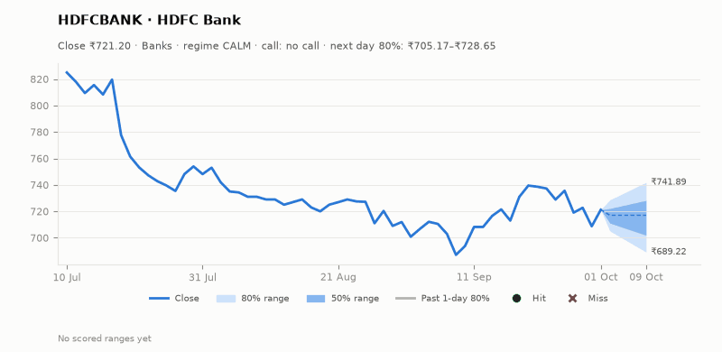
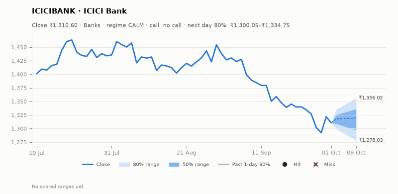

HDFCBANK: Anup Bagchi was named CEO and brokerages say that lifts an overhang (cf75cbaa061317c3). The Q2 update was solid (ec8481a18d7af128), but the stock reversed lower on Oct 5 (398c0ded37caf25e). ICICIBANK led the Oct 5 rebound and its ADR is +1.35%. Bull: the overhang is gone and RSI is low. Bear: hike risk on Oct 7. The two moved apart on Oct 5 on company news.

### IT

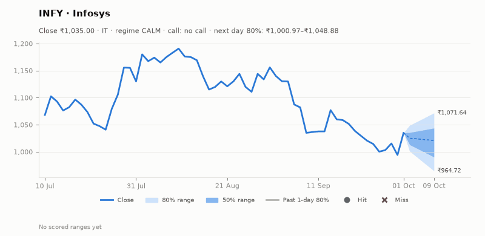
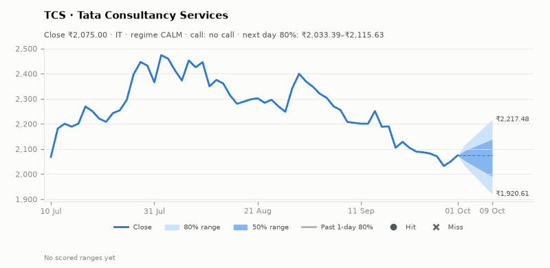

INFY's Oct 1 pop (+4.1%, on the Accenture beat) faded on Oct 5 (2c38671395c32330), and its ADR is -2.72%. TCS bought Best Buy's India capability centre (a4b9512b6f4bbbcf) and reports on Oct 8; the 5d range is widened for earnings. Bull: oversold and Accenture read-through. Bear: muted demand (ca095e3291db00ca). The sector moves together into the TCS print.

### Insurance

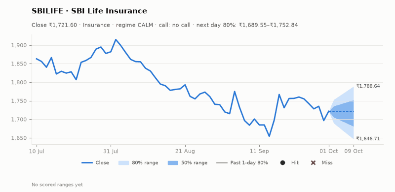
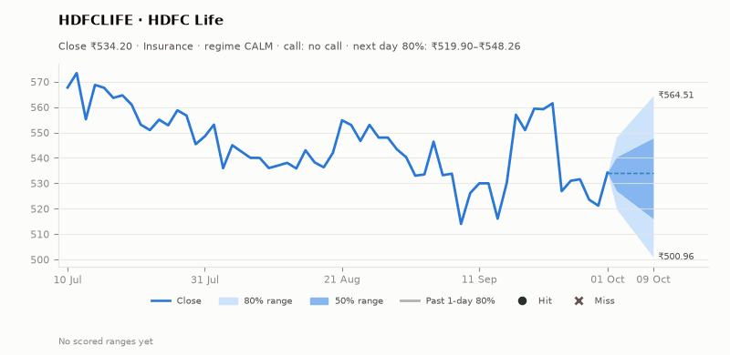

IRDAI proposed caps on distributor commissions (1f1fd6f003ff4e47), and the sector fell on Oct 5, so they moved together. Analysts see HDFC Life as most exposed and SBI Life as best placed (b999c6bedbf94702). Bull: SBILIFE's relative strength. Bear: HDFCLIFE gives back its Oct 1 gain (d1 +2.49%). HDFC Life reports Oct 15.

### Transport

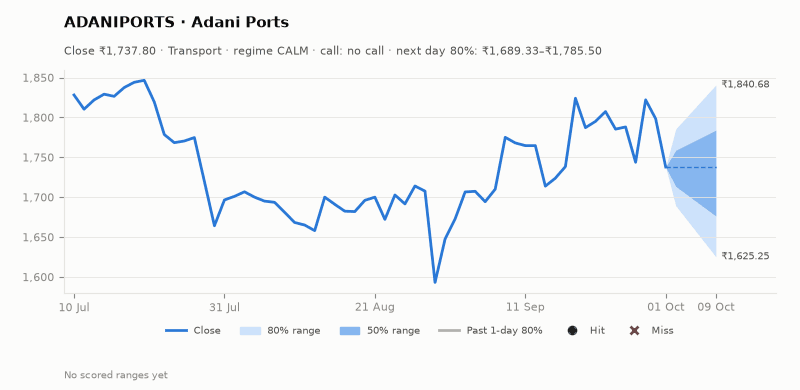
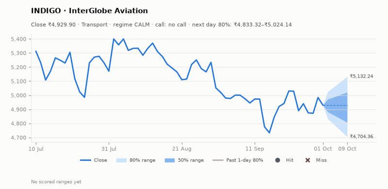

ADANIPORTS: HSBC kept Buy after record Q2 throughput (31b8d676b45c9c07), and Adani stocks rose on Oct 5 (89999c77439ec4da). INDIGO: Nomura initiated at Buy (d15f04491ed50a8f), and a fuel surcharge applies from Oct 6 (4dc8c514b0cdaa18). Bull: broker support for both. Bear: high beta (1.82 for INDIGO) and crude risk. The two moved on separate company news.

### Energy

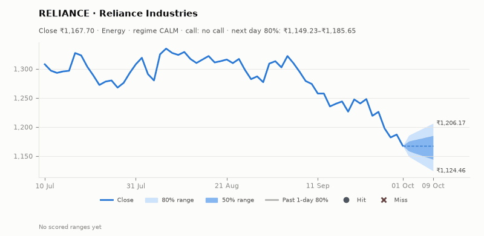
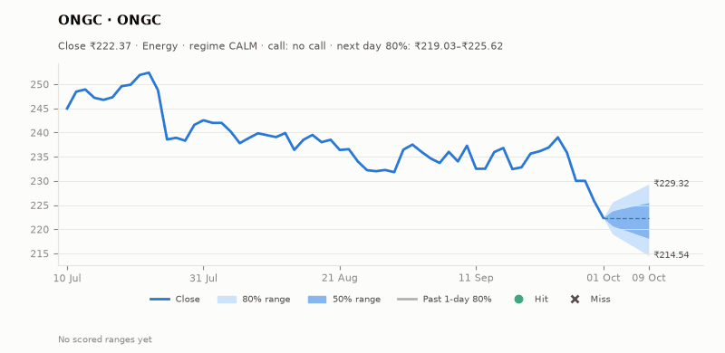

RELIANCE: the Jio Platforms IPO is reportedly set for Oct 21 (86259bfed07df0b7), and Meta will lease an AI data centre from Reliance (09c351481b3f249f). It co-led the Oct 5 rebound from RSI 28. ONGC is weak (d5 -6.96%), and the Saudi OSP cut weighs on realisations (5d068a7b6a5d1161). Bull: Reliance catalysts. Bear: ONGC's price. The two moved apart on company news.

### Pharma

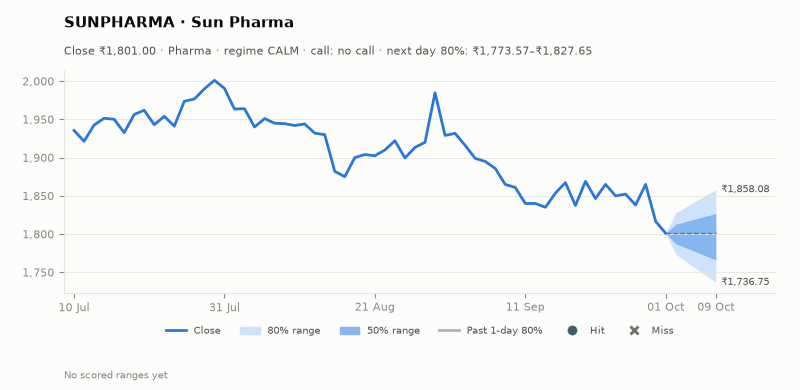
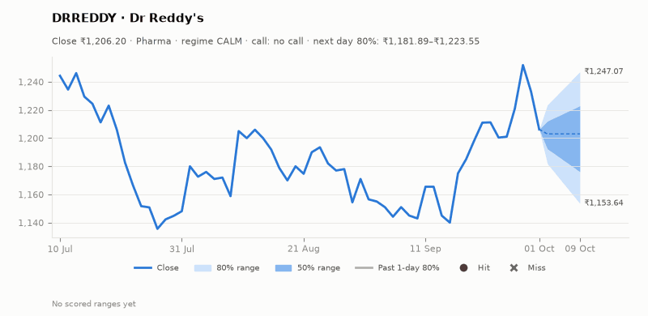

Pharma fell for a third day on Oct 5 (9e91d467d35a97c4), so the two moved together on sector news. SUNPHARMA: a report of a $12B bid for Organon (dab084298d9c201b); this is unverified and earlier reports date to April, raising acquirer leverage concerns. DRREDDY has the best technicals in the watchlist (RSI 54), but its ADR is -0.53%. Bull: trend (DRREDDY). Bear: sector selling.

### Autos

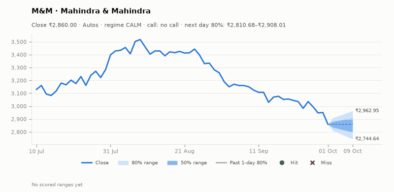
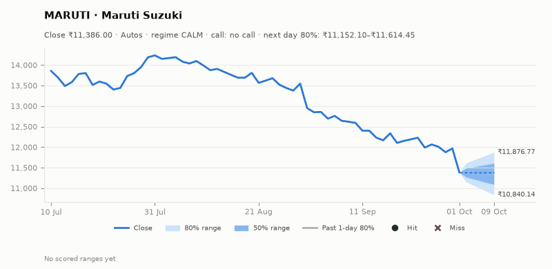

M&M (RSI 23) and MARUTI (RSI 22) are the most oversold names after heavy-volume selling on Oct 1, so they moved together. Autos edged up on Oct 5 (c84ad0d088babcbf). Bull: mean reversion, and SUV sales are up 21% (9a3bb273a22cee6d). Bear: a rate hike hits car demand. The Maruti investor meet is on Oct 8.

### Consumer goods

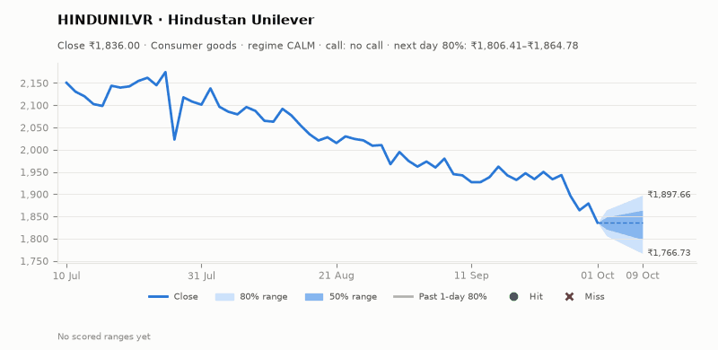
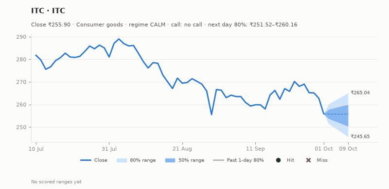

ITC: Citi upgraded to Buy with a Rs 300 target (7c751ef2b66164e7), and it rose about 2% on Oct 5. HINDUNILVR lagged at a 52-week low (21716825530a2eed, 9670ceb55986fe7c). Bull: FMCG value growth (132ff5092fbae78b). Bear: HUL's relative weakness. The two moved apart on company news.

### Construction

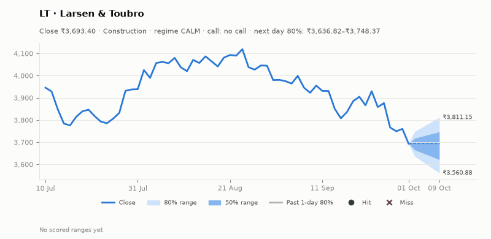
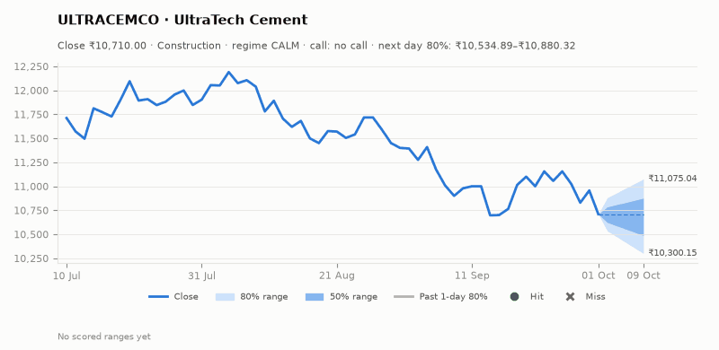

LT won Rs 10-15k cr of transmission orders (08163ca1ed96e80e) and rose on Oct 5, though OBV (-2.0) shows distribution. ULTRACEMCO: I-Sec raised its target (744401577ecde3f0). Bull: orders and the target raise. Bear: a hike hurts housing and infrastructure demand. Both had weak trends to Oct 1, and moved separately on company news.

### Metals

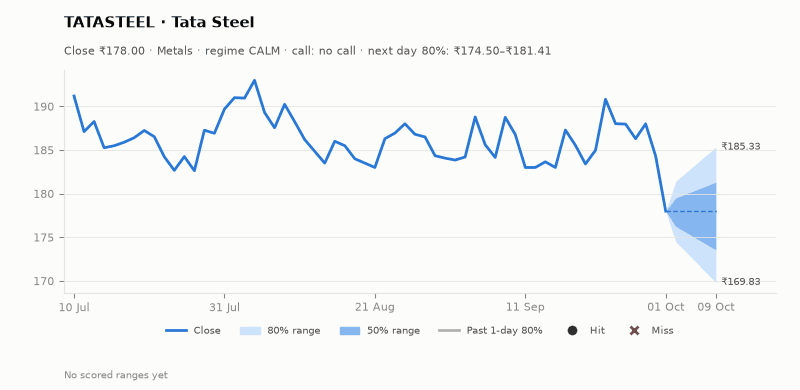
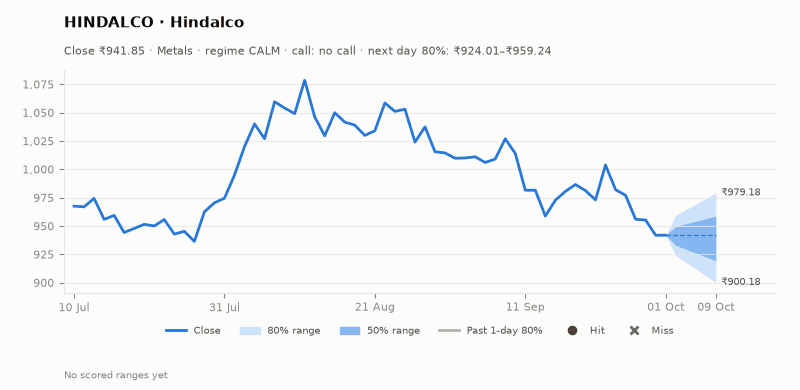

TATASTEEL fell 3.42% on Oct 1 on heavy volume. The CEO sees 7-8% demand growth (41f830cd15edab8f), but the trade-talk plateau weighs (01bf111078e38ce3). HINDALCO has no stock-specific news (d5 -4.09%). Bull: oversold. Bear: dollar strength and trade. Both moved with the sector.

## Track record

Ranges (targets 50% / 80%; width and score in % of price, score lower is better):

_none_

Up/down calls vs the always-up baseline:

_none_

## Data quality

- Indicators: 20 OK, partial: none, blocked: none
- Regime notes: none

| H | Calibration | History n | Live n | q10 / q90 |
|---|---|---|---|---|
| 1d | pool | 8640 | 0 | -1.25 / 1.20 |
| 5d | pool | 8560 | 0 | -1.33 / 1.14 |

- Collectors: none failed. Prices added 0 new bars, because today's bar is skipped by design; latest bar Oct 1. Quotes: 15 of 15. News: 31 feeds, 72 new items (902 today). Events: 0 new. Filings: not applicable for India.
- About 250 of 902 headlines carry wrong ticker tags (noise).
- The run was late (~20:10 IST vs the scheduled 08:10 IST), so there are no calls, and the cue-adjusted 1d ranges use post-close ADR quotes.
