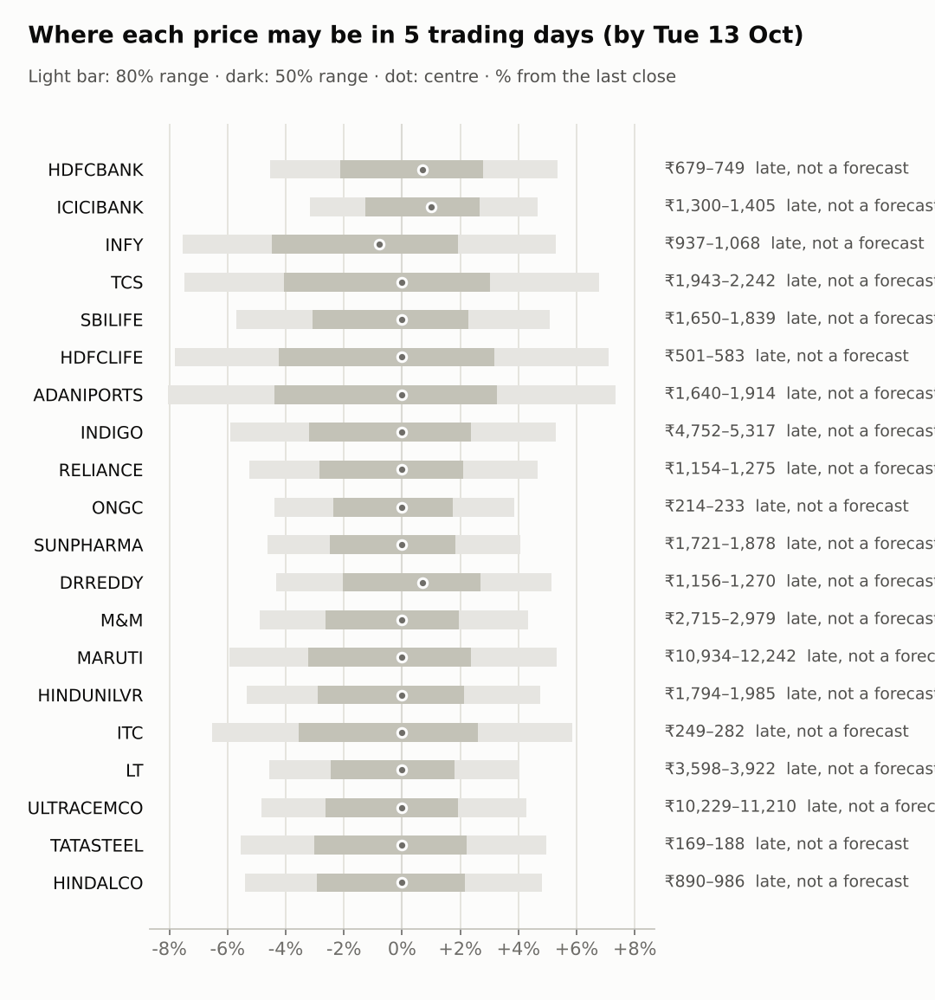
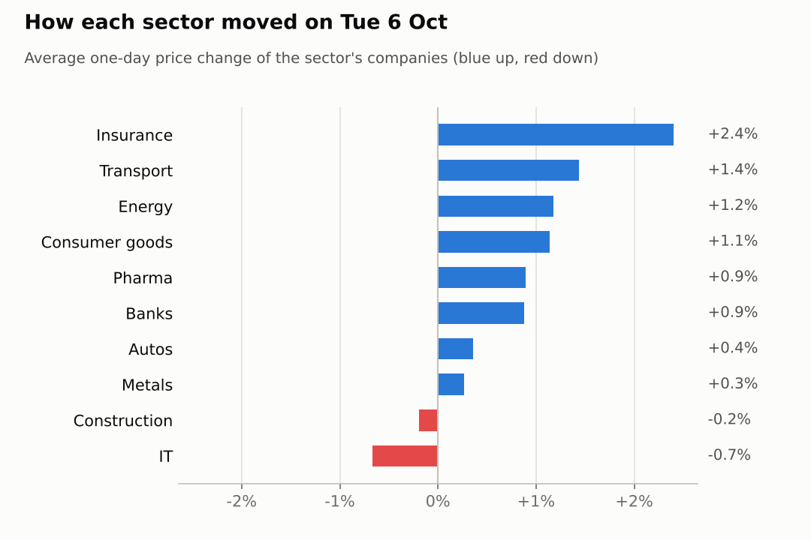

# Market brief: India (NSE), 2026-10-07

_Research log, not investment advice. Generated by a scheduled Claude Code routine._
<!-- report-data: as_of=2026-10-06 regime=EVENT_HEAVY -->

Easy-to-read version with charts and filters: [2026-10-07.html](2026-10-07.html)

## Headline
The RBI raised the repo rate by 25 bp to 5.5% this morning, its first hike since 2023 (794087886a3bc280, c3b100e7cd04db0b), and the Nifty 50 was -0.41% shortly after the open. This run started after the open, so it makes no calls today.

## Top 3 today
- RBI rate hike: the repo rate rose 25 bp to 5.5% at today's policy decision (c3b100e7cd04db0b), which keeps the regime EVENT_HEAVY.
- L&T: a new order is confirmed by its NSE announcement (nse-ann-106809242), the only news event today confirmed by a primary source.
- TCS reports quarterly results tomorrow (2026-10-08), the first big IT print of the season; Infosys's ADR fell 1.58% overnight.

## Yesterday
The Nifty 50 rose 1.0% on 2026-10-06, with 14 watchlist stocks up and 6 down. HINDUNILVR led (+3.1%) and RELIANCE gained 2.66% on Jio IPO reports that are still rated rumour (e309d383688bd411). ULTRACEMCO was the weakest (-0.9%). FIIs sold a net 2,961 cr and DIIs bought a net 5,089 cr (provisional). No ranges have matured yet, so there is nothing to score.

Market on 2026-10-06: Nifty 50 22,776.10 (+1.0%) · India VIX 13.61 (-7.9%) · watchlist 14 up / 6 down · best HINDUNILVR +3.1%, worst ULTRACEMCO -0.9%

### Ranges scored (target date –)

No ranges have matured yet.

_none_

### Calls scored

_none_

## Today (2026-10-07)

**Regime: EVENT_HEAVY** · India VIX 13.74 (+0.9%) · benchmark 5d -0.0% · benchmark 10d vol 14.3% · major events: RBI policy decision

| Ticker | Sector | Close | Next day 80% | Next day 50% | 5 days 80% | Call | Cue | Notes |
|---|---|---|---|---|---|---|---|---|
| HDFCBANK | Banks | ₹711.45 | – | – | ₹679.23–₹749.41 | late: not a forecast, never scored | – | cue +1.40% x0.5; late: 2026-10-07 opened before made_at; major event x1.15; regime EVENT_HEAVY x1.1 |
| ICICIBANK | Banks | ₹1,342.80 | – | – | ₹1,300.26–₹1,405.47 | late: not a forecast, never scored | – | cue +2.02% x0.5; late: 2026-10-07 opened before made_at; major event x1.15; regime EVENT_HEAVY x1.1 |
| INFY | IT | ₹1,013.85 | – | – | ₹937.27–₹1,067.58 | late: not a forecast, never scored | – | cue -1.58% x0.5; late: 2026-10-07 opened before made_at; major event x1.15; regime EVENT_HEAVY x1.1 |
| TCS | IT | ₹2,100.00 | – | – | ₹1,942.99–₹2,242.44 | late: not a forecast, never scored | – | earnings in horizon (x2.0 day); late: 2026-10-07 opened before made_at; major event x1.15; regime EVENT_HEAVY x1.1 |
| SBILIFE | Insurance | ₹1,750.00 | – | – | ₹1,650.19–₹1,838.98 | late: not a forecast, never scored | – | late: 2026-10-07 opened before made_at; major event x1.15; regime EVENT_HEAVY x1.1 |
| HDFCLIFE | Insurance | ₹543.95 | – | – | ₹501.47–₹582.62 | late: not a forecast, never scored | – | late: 2026-10-07 opened before made_at; major event x1.15; regime EVENT_HEAVY x1.1 |
| ADANIPORTS | Transport | ₹1,783.40 | – | – | ₹1,640.10–₹1,914.13 | late: not a forecast, never scored | – | late: 2026-10-07 opened before made_at; major event x1.15; regime EVENT_HEAVY x1.1 |
| INDIGO | Transport | ₹5,050.50 | – | – | ₹4,751.67–₹5,317.45 | late: not a forecast, never scored | – | late: 2026-10-07 opened before made_at; major event x1.15; regime EVENT_HEAVY x1.1 |
| RELIANCE | Energy | ₹1,218.00 | – | – | ₹1,153.97–₹1,274.83 | late: not a forecast, never scored | – | late: 2026-10-07 opened before made_at; major event x1.15; regime EVENT_HEAVY x1.1 |
| ONGC | Energy | ₹224.20 | – | – | ₹214.35–₹232.87 | late: not a forecast, never scored | – | late: 2026-10-07 opened before made_at; major event x1.15; regime EVENT_HEAVY x1.1 |
| SUNPHARMA | Pharma | ₹1,804.10 | – | – | ₹1,720.73–₹1,877.64 | late: not a forecast, never scored | – | late: 2026-10-07 opened before made_at; major event x1.15; regime EVENT_HEAVY x1.1 |
| DRREDDY | Pharma | ₹1,208.00 | – | – | ₹1,155.63–₹1,270.02 | late: not a forecast, never scored | – | cue +1.38% x0.5; late: 2026-10-07 opened before made_at; major event x1.15; regime EVENT_HEAVY x1.1 |
| M&M | Autos | ₹2,855.00 | – | – | ₹2,715.35–₹2,978.51 | late: not a forecast, never scored | – | late: 2026-10-07 opened before made_at; major event x1.15; regime EVENT_HEAVY x1.1 |
| MARUTI | Autos | ₹11,625.00 | – | – | ₹10,934.27–₹12,242.20 | late: not a forecast, never scored | – | late: 2026-10-07 opened before made_at; major event x1.15; regime EVENT_HEAVY x1.1 |
| HINDUNILVR | Consumer goods | ₹1,895.20 | – | – | ₹1,794.08–₹1,985.02 | late: not a forecast, never scored | – | late: 2026-10-07 opened before made_at; major event x1.15; regime EVENT_HEAVY x1.1 |
| ITC | Consumer goods | ₹266.70 | – | – | ₹249.31–₹282.33 | late: not a forecast, never scored | – | late: 2026-10-07 opened before made_at; major event x1.15; regime EVENT_HEAVY x1.1 |
| LT | Construction | ₹3,770.00 | – | – | ₹3,597.89–₹3,921.74 | late: not a forecast, never scored | – | late: 2026-10-07 opened before made_at; major event x1.15; regime EVENT_HEAVY x1.1 |
| ULTRACEMCO | Construction | ₹10,750.00 | – | – | ₹10,229.38–₹11,210.25 | late: not a forecast, never scored | – | late: 2026-10-07 opened before made_at; major event x1.15; regime EVENT_HEAVY x1.1 |
| TATASTEEL | Metals | ₹178.69 | – | – | ₹168.75–₹187.54 | late: not a forecast, never scored | – | late: 2026-10-07 opened before made_at; major event x1.15; regime EVENT_HEAVY x1.1 |
| HINDALCO | Metals | ₹940.50 | – | – | ₹889.72–₹985.64 | late: not a forecast, never scored | – | late: 2026-10-07 opened before made_at; major event x1.15; regime EVENT_HEAVY x1.1 |

20 stock(s) have ranges made after the first session they cover had opened (a mid-session or late run): they are shown for the record, are not forecasts and are never scored.

No calls today: every ticker and horizon abstained because this is a mid-session run (the session opened before the run started).
- All 20 tickers would also have abstained with "data failed validation": the collect gate failed on today's earnings-estimates file (see Data quality).
- TCS is also hard-blocked: it reports earnings within 1 day.
- LT was the only possible lean up: its order is confirmed (nse-ann-106809242), and the signal model's chance of a rise is 0.508 for 1 day. Every other ticker sits near its base rate.

### Overnight cues and global factors

| Symbol | Name | Last | Change |
|---|---|---|---|
| BRENT | Brent crude | 101.63 | +1.04% |
| DXY | US dollar index | 102.07 | +0.23% |
| GOLD | Gold | 4,164.90 | -0.53% |
| HANGSENG | Hang Seng | 24,151.90 | -0.53% |
| INDIAVIX | India VIX | 13.74 | +0.94% |
| NASDAQ | Nasdaq Composite (previous US close) | 27,599.89 | +0.45% |
| NIFTY50 | Nifty 50 | 22,681.75 | -0.41% |
| NIKKEI | Nikkei 225 | 70,091.04 | -0.84% |
| SPX | S&P 500 (previous US close) | 7,818.93 | +0.58% |
| US10Y | US 10-year yield | 5.27 | -0.79% |
| USDINR | USD/INR | 96.43 | +0.09% |

### ADRs (US-listed shares, previous US session)

| Ticker | ADR | Last | Change |
|---|---|---|---|
| DRREDDY | RDY | 12.49 | +1.38% |
| HDFCBANK | HDB | 22.42 | +1.40% |
| ICICIBANK | IBN | 28.31 | +2.02% |
| INFY | INFY | 10.59 | -1.58% |

## Tomorrow and this week

| Date | Event | Type |
|---|---|---|
| 2026-10-07 | RBI policy decision | major |
| 2026-10-08 | Tata Consultancy Services earnings | company |
| 2026-10-13 | Nifty weekly options expiry (Tuesday) |  |
| 2026-10-15 | HDFC Life earnings | company |
| 2026-10-16 | Reliance Industries earnings | company |
| 2026-10-17 | HDFC Bank earnings | company |
| 2026-10-17 | ICICI Bank earnings | company |
| 2026-10-19 | Nifty weekly options expiry (Tuesday) |  |
| 2026-10-19 | UltraTech Cement earnings | company |
| 2026-10-23 | Dr Reddy's earnings | company |
| 2026-10-23 | Infosys earnings | company |
| 2026-10-23 | SBI Life Insurance earnings | company |
| 2026-10-27 | NSE monthly F&O expiry (last Tuesday) | major |
| 2026-10-27 | Nifty weekly options expiry (Tuesday) |  |

Key risks: how the market digests the RBI hike (c3b100e7cd04db0b) through the rest of today's session, and TCS results tomorrow (2026-10-08), which set the tone for IT. Foreign selling continues: FIIs sold a net 7,660 cr over the last 2 reported days. Brent is at 101.63 (+1.04%) and USD/INR at 96.433, both pressures for an oil importer. Bank, insurance and Reliance results follow from 2026-10-15.

## By sector

### Banks

HDFCBANK rose 0.94% and ICICIBANK 0.81% on 2026-10-06, and both ADRs rose overnight (HDFCBANK +1.4%, ICICIBANK +2.02%). Bull: Bernstein sees a ₹1,150 target for HDFC Bank (dd31e044314de2b7, single source). Bear: HDFC Bank still trades on doubts about its outsider CEO pick (ba14ee8a9b2558de). Both banks report on 2026-10-17. They moved together, led by sector strength.

### IT

INFY fell 0.65% and TCS 0.68% on 2026-10-06; Infosys's ADR fell 1.58% overnight. Bull: brokers expect TCS margins to expand (dbdd32127b1d4d77, single source). Bear: both are down sharply over 20 days (INFY -10.28%, TCS -8.85%), and TCS reports tomorrow. They moved together (sector).

### Insurance

HDFCLIFE rose 2.44% and SBILIFE 2.37% on 2026-10-06. Bull: SBILIFE sits near its 20-day high. Bear: HDFCLIFE's rise came with heavy volume ahead of its 2026-10-15 results. They moved together (sector).

### Transport

INDIGO rose 2.34% and ADANIPORTS 0.53% on 2026-10-06. Bull: Elara expects a large rise in IndiGo's quarterly profit (593b8ba38980ba19, single source). Bear: INDIGO is at the top of its 20-day range with a high beta of 1.82. Both bars for 2026-10-06 came from the NSE bhavcopy.

### Energy

RELIANCE rose 2.66% and ONGC fell 0.31% on 2026-10-06. Bull: Jio IPO reports lifted Reliance (e309d383688bd411), but they are rated rumour. Bear: Reliance is still down 7.87% over 20 days and reports on 2026-10-16. They moved apart (company news).

### Pharma

SUNPHARMA rose 1.37% and DRREDDY 0.42% on 2026-10-06, as the Nifty Pharma index rose 1.66%; Dr Reddy's ADR rose 1.38% overnight. Bull: DRREDDY is up 4.95% over 20 days. Bear: SUNPHARMA is still down 5.0% over 20 days. They moved together (sector).

### Autos

MARUTI rose 0.81% and M&M fell 0.09% on 2026-10-06. Bull: M&M is deeply oversold (RSI 23). Bear: both are down over 20 days (M&M -9.94%, MARUTI -8.42%) and neither has news. They moved apart but without a company catalyst.

### Consumer goods

HINDUNILVR rose 3.09% and ITC fell 0.82% on 2026-10-06. Bull: HINDUNILVR's rise came with above-average volume. Bear: HINDUNILVR is still down 3.96% over 20 days, so the bounce may fade. They moved apart, with no company news.

### Construction

LT rose 0.53% and ULTRACEMCO fell 0.92% on 2026-10-06. Bull: L&T announced a new order on NSE (nse-ann-106809242). Bear: L&T is still down 4.9% over 20 days. They moved apart (company news).

### Metals

TATASTEEL rose 0.31% and HINDALCO 0.22% on 2026-10-06. Bull: Tata Steel's CEO expects steel demand to grow (451199f29e65750e, single source). Bear: both are down over 20 days (HINDALCO -6.97%, TATASTEEL -5.35%). They moved together, with no clear catalyst.

## Track record

Ranges (targets 50% / 80%; width, score and centre error in % of price, lower is better; naive = last close ± recent typical move, no-change = last close as the centre):

_none_

Ranges by regime (since start):

_none_

Up/down calls vs the always-up baseline:

_none_

Calls by confidence band (a band should hit about as often as its confidence):

_none_

Weekly review 2026-W40: 1 proposed range change for a human to decide (low sample) · [review-2026-W40.md](review-2026-W40.md)

## Data quality

- Indicators: 20 OK, partial: none, blocked: none
- Regime notes: none

| H | Calibration | History n | Live n | q10 / q90 |
|---|---|---|---|---|
| 1d | pool | 8680 | 0 | -1.27 / 1.20 |
| 5d | pool | 8600 | 0 | -1.34 / 1.13 |

- Mid-session run: the run started after the session opened (03:45 UTC), so no calls or 1-day ranges were made and the 5-day ranges are late (shown, never scored).
- validation: collect, SCHEMA (blocking, failed again on retry): data/india/earnings_estimates/2026/10/2026-10-07.jsonl, report_at values (scheduled earnings report times) are later than the run time; tickers ADANIPORTS, DRREDDY, HDFCBANK, HDFCLIFE, HINDALCO, HINDUNILVR, ICICIBANK, INDIGO, INFY, ITC, LT, M&M, MARUTI, ONGC, RELIANCE, SBILIFE, SUNPHARMA, TATASTEEL, TCS, ULTRACEMCO. Dropped: nothing extra (no calls on a mid-session run); every ticker would have abstained with "data failed validation". This looks like a gate false positive on a future-dated field (same failure as the US run today) and needs a code fix.
- validation: features, context, news, forecast passed (no failures or warnings).
- validation: report, UNMATCHED_NUMBER (first pass only): the Slack draft quoted the RBI rate numbers without citing the news id; fixed on retry by citing c3b100e7cd04db0b.
- Bar from the NSE bhavcopy (Yahoo had none): ADANIPORTS 2026-10-06, INDIGO 2026-10-06.
- Collectors: no failures; filings, options, macro and shorts are skipped for India (no source configured). collect_articles: 19 headlines from unvetted outlets were not read (skipped_unlisted).
- News scoring: the news-analyst scored most of the 1018 headlines with a keyword-rule pass, so low-materiality scores and summaries are coarse.
- Claims: 24 claim records stored for 11 of 15 selected events; 4 had no checkable claim.
