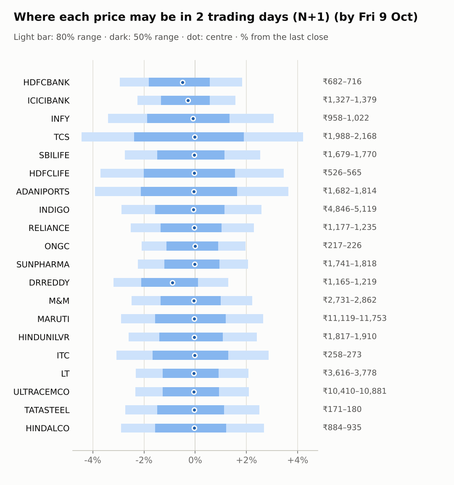
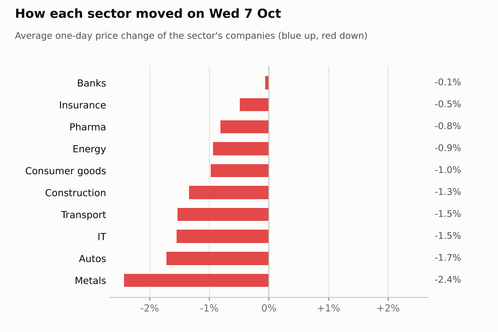

# Market brief: India (NSE), 2026-10-08

_Research log, not investment advice. Generated by a scheduled Claude Code routine._
<!-- report-data: as_of=2026-10-07 regime=CALM outcome=695fa078534e -->

Easy-to-read version with charts and filters: [2026-10-08.html](2026-10-08.html)

## Headline
No calls today: the forecaster abstained on all 20 stocks because the signal model sits near its base rate and almost no news is verified. TCS reports results today, and the Nifty 50 starts after a -0.76% day with FIIs net sellers.

## Top 3 today
- TCS reports quarterly results today, so no call is allowed on it; previews expect steady margins (5b5003d0d2bba226).
- LT is the only stock with primary-source confirmed news: order wins filed on NSE (nse-ann-106806590, nse-ann-106809242); the model gives LT P(up) 0.5210 for N+1.
- FIIs sold a net 6,121 crore on 2026-10-07 while DIIs bought 4,597 crore (2a498de2b68c60d0), and overnight cues are soft (Euro Stoxx 50 -1.57%).

## Yesterday
The Nifty 50 fell 0.76% after the RBI raised the repo rate (0a1f129e87a17be0); 18 of 20 watchlist stocks fell.
HINDALCO dropped 3.15% as metals sold off (c52d2ecd82453d6b); ICICIBANK rose 1.09% against the market.
No ranges matured yet, so there is nothing to score.

Market on 2026-10-07: Nifty 50 22,603.05 (-0.8%) · India VIX 13.89 (+2.1%) · watchlist 2 up / 18 down · best ICICIBANK +1.1%, worst HINDALCO -3.2%

### Ranges scored (target date –)

No ranges have matured yet.

_none_

### Calls scored

_none_

## Today (2026-10-08)

**Regime: CALM** · India VIX 13.90 (+2.1%) · benchmark 5d -0.5% · benchmark 10d vol 14.5%

| Ticker | Sector | Close | N+1 80% | N+1 50% | N+5 80% | Call | Cue | Notes |
|---|---|---|---|---|---|---|---|---|
| HDFCBANK | Banks | ₹702.75 | ₹682.01–₹715.61 | ₹690.05–₹706.76 | ₹668.22–₹727.39 | no call | -0.98% | cue -0.98% x0.5; index -0.08% expected from SPX, x beta 1.24 x0.5, own cue -0.98% net x0.5 |
| ICICIBANK | Banks | ₹1,357.50 | ₹1,326.92–₹1,378.70 | ₹1,339.36–₹1,365.12 | ₹1,305.52–₹1,396.73 | no call | -0.57% | cue -0.57% x0.5; index -0.08% expected from SPX, x beta 0.91 x0.5, own cue -0.57% net x0.5 |
| INFY | IT | ₹992.00 | ₹958.18–₹1,022.36 | ₹973.45–₹1,005.36 | ₹932.15–₹1,045.11 | no call | -0.19% | cue -0.19% x0.5; index -0.08% expected from SPX, x beta 0.68 x0.5, own cue -0.19% net x0.5 |
| TCS | IT | ₹2,080.30 | ₹1,988.14–₹2,167.74 | ₹2,030.52–₹2,119.79 | ₹1,952.67–₹2,197.63 | no call | – | earnings in horizon (x2.0 day); index -0.08% expected from SPX, x beta 0.76 x0.5 |
| SBILIFE | Insurance | ₹1,726.10 | ₹1,678.55–₹1,769.95 | ₹1,700.40–₹1,745.84 | ₹1,641.74–₹1,802.70 | no call | – | index -0.08% expected from SPX, x beta 0.86 x0.5 |
| HDFCLIFE | Insurance | ₹546.05 | ₹525.85–₹564.93 | ₹535.12–₹554.55 | ₹502.56–₹586.77 | no call | – | earnings in horizon (x2.0 day); index -0.08% expected from SPX, x beta 0.97 x0.5 |
| ADANIPORTS | Transport | ₹1,750.10 | ₹1,681.78–₹1,813.64 | ₹1,713.03–₹1,778.58 | ₹1,629.59–₹1,861.71 | no call | – | index -0.08% expected from SPX, x beta 1.35 x0.5 |
| INDIGO | Transport | ₹4,990.00 | ₹4,846.49–₹5,118.88 | ₹4,911.56–₹5,046.99 | ₹4,738.67–₹5,218.54 | no call | – | index -0.08% expected from SPX, x beta 1.82 x0.5 |
| RELIANCE | Energy | ₹1,207.70 | ₹1,177.40–₹1,235.42 | ₹1,191.29–₹1,220.14 | ₹1,154.02–₹1,256.23 | no call | – | index -0.08% expected from SPX, x beta 0.95 x0.5 |
| ONGC | Energy | ₹221.88 | ₹217.24–₹226.23 | ₹219.40–₹223.87 | ₹213.54–₹229.37 | no call | – | index -0.08% expected from SPX, x beta 0.03 x0.5 |
| SUNPHARMA | Pharma | ₹1,781.00 | ₹1,741.19–₹1,817.83 | ₹1,759.58–₹1,797.69 | ₹1,709.95–₹1,844.95 | no call | – | index -0.08% expected from SPX, x beta 0.48 x0.5 |
| DRREDDY | Pharma | ₹1,203.80 | ₹1,165.43–₹1,219.28 | ₹1,178.34–₹1,205.12 | ₹1,143.29–₹1,238.11 | no call | -1.76% | cue -1.76% x0.5; index -0.08% expected from SPX, x beta 0.47 x0.5, own cue -1.76% net x0.5 |
| M&M | Autos | ₹2,800.00 | ₹2,730.62–₹2,862.40 | ₹2,762.19–₹2,827.72 | ₹2,678.01–₹2,910.20 | no call | – | index -0.08% expected from SPX, x beta 1.42 x0.5 |
| MARUTI | Autos | ₹11,450.00 | ₹11,119.39–₹11,753.47 | ₹11,270.81–₹11,586.09 | ₹10,865.31–₹11,982.05 | no call | – | index -0.08% expected from SPX, x beta 1.10 x0.5 |
| HINDUNILVR | Consumer goods | ₹1,865.40 | ₹1,816.80–₹1,910.18 | ₹1,839.15–₹1,885.58 | ₹1,779.10–₹1,943.56 | no call | – | index -0.08% expected from SPX, x beta 0.79 x0.5 |
| ITC | Consumer goods | ₹265.70 | ₹257.53–₹273.31 | ₹261.29–₹269.14 | ₹251.18–₹278.96 | no call | – | index -0.08% expected from SPX, x beta 0.68 x0.5 |
| LT | Construction | ₹3,701.50 | ₹3,615.66–₹3,778.22 | ₹3,654.65–₹3,735.49 | ₹3,550.80–₹3,837.25 | no call | – | index -0.08% expected from SPX, x beta 1.45 x0.5 |
| ULTRACEMCO | Construction | ₹10,658.00 | ₹10,409.71–₹10,881.50 | ₹10,522.85–₹10,757.46 | ₹10,220.73–₹11,052.02 | no call | – | index -0.08% expected from SPX, x beta 1.27 x0.5 |
| TATASTEEL | Metals | ₹175.64 | ₹170.84–₹180.04 | ₹173.04–₹177.61 | ₹167.14–₹183.35 | no call | – | index -0.08% expected from SPX, x beta 1.06 x0.5 |
| HINDALCO | Metals | ₹910.85 | ₹884.46–₹935.30 | ₹896.60–₹921.88 | ₹863.99–₹953.51 | no call | – | index -0.08% expected from SPX, x beta 0.79 x0.5 |

Calls: none.
Abstentions (all 20 stocks, N+1 and N+5): the signal model's P(up) is close to its base rate for every stock, and only LT has confirmed news.
- TCS: hard block, results today (earnings within 1 day).
- LT: model P(up) 0.5210 rests on order wins public for two sessions (nse-ann-106806590); the stock still fell 1.82%, so the edge is too thin.
- RELIANCE: the Jio IPO items are rated rumour and cannot support a call.
- TATASTEEL: the Q2 volume update (nse-ann-106810367) is single source.
- HDFCLIFE: results on 2026-10-15 fall inside the 5-day window.
- Others: no verified company news; oversold readings (M&M RSI 20) are already in the model.
AI traders (paper, separate from the brief): the news trader and the Opus combined trader each called LT up at N+3 and N+5; the pattern trader made 6 oversold-bounce calls (M&M, MARUTI, HINDALCO); the Sonnet combined trader followed the model on 56 calls. Each abstained on TCS (earnings window).

### Overnight cues and global factors

| Symbol | Name | Last | Change |
|---|---|---|---|
| BRENT | Brent crude | 101.88 | +1.29% |
| DXY | US dollar index | 102.17 | +0.33% |
| GOLD | Gold | 4,158.60 | -0.68% |
| HANGSENG | Hang Seng | 24,075.40 | -0.23% |
| INDIAVIX | India VIX | 13.90 | +2.11% |
| KOSPI | KOSPI | 6,793.26 | -0.16% |
| NASDAQ | Nasdaq Composite (previous US close) | 27,538.69 | -0.22% |
| NIFTY50 | Nifty 50 | 22,603.05 | -0.76% |
| NIKKEI | Nikkei 225 | 69,488.72 | -0.78% |
| SHANGHAI | Shanghai Composite | 3,857.76 | +0.41% |
| SPX | S&P 500 (previous US close) | 7,801.77 | -0.22% |
| STOXX50 | Euro Stoxx 50 | 6,173.45 | -1.57% |
| TAIWAN | Taiwan Weighted | 49,550.12 | -0.51% |
| US10Y | US 10-year yield | 5.28 | +0.15% |
| USDINR | USD/INR | 96.75 | +0.39% |
| USDJPY | USD/JPY | 157.79 | -0.32% |
| USVIX | US VIX | 15.08 | +0.47% |

### ADRs (US-listed shares, previous US session)

| Ticker | ADR | Last | Change |
|---|---|---|---|
| DRREDDY | RDY | 12.27 | -1.76% |
| HDFCBANK | HDB | 22.20 | -0.98% |
| ICICIBANK | IBN | 27.86 | -0.57% |
| INFY | INFY | 10.53 | -0.19% |

## Tomorrow and this week

| Date | Event | Type |
|---|---|---|
| 2026-10-08 | Tata Consultancy Services earnings | company |
| 2026-10-13 | Nifty weekly options expiry (Tuesday) |  |
| 2026-10-15 | HDFC Life earnings | company |
| 2026-10-16 | Reliance Industries earnings | company |
| 2026-10-17 | HDFC Bank earnings | company |
| 2026-10-17 | ICICI Bank earnings | company |
| 2026-10-19 | Nifty weekly options expiry (Tuesday) |  |
| 2026-10-19 | UltraTech Cement earnings | company |
| 2026-10-23 | Dr Reddy's earnings | company |
| 2026-10-23 | Infosys earnings | company |
| 2026-10-23 | SBI Life Insurance earnings | company |
| 2026-10-27 | NSE monthly F&O expiry (last Tuesday) | major |
| 2026-10-27 | Nifty weekly options expiry (Tuesday) |  |
| 2026-10-28 | Adani Ports earnings | company |
| 2026-10-28 | Larsen & Toubro earnings | company |

Key risks: TCS results today can move the IT sector; HDFC Life (2026-10-15), Reliance (2026-10-16) and HDFC Bank and ICICI Bank (2026-10-17) report next. Overnight cues are mostly negative (Nikkei -0.78%), Brent is up 1.29% and USD/INR rose 0.39%. The regime is CALM with India VIX at 13.8975, but FII selling has run three days in a row (FII -13,782 crore).

## By sector

### Banks

HDFCBANK fell 1.22% while ICICIBANK rose 1.09%, so the two moved apart on company news.
Bull: ICICIBANK's broker target was raised (e42a13280acb2dc4, promotional); HDFCBANK named Anup Bagchi CEO (d257a3142db62ea4).
Bear: HDFCBANK is 7.81% behind its peer over 5 days and its ADR fell 0.98% overnight.

### IT

TCS reports today; INFY fell 2.16% and the Nifty IT index 1.34%.
Bull: TCS previews expect steady margins (5b5003d0d2bba226).
Bear: a broker cut its INFY target (495cae5386b66a76); INFY's d20 is -8.78%.

### Insurance

HDFCLIFE rose 0.39% and SBILIFE fell 1.37%: they moved apart without company news.
Bull: HDFCLIFE's d5 is +4.3%.
Bear: SBILIFE has no verified catalyst; HDFCLIFE reports on 2026-10-15.

### Transport

INDIGO fell 1.2% on volume 2.5 times its average; ADANIPORTS fell 1.87%.
Bull: a broker set an INDIGO target of 6,000 (095097a578da8f27).
Bear: jet fuel prices rose (0b407266de7acccb), a cost for INDIGO.

### Energy

RELIANCE fell 0.85% and ONGC 1.03%, moving together.
Bull: the Jio IPO reports (16eb534a5b17bf65) are rated rumour, so they carry no weight.
Bear: a windfall tax on petrol was reported (4e8b515bd3620963), not yet verified.

### Pharma

SUNPHARMA fell 1.28% and DRREDDY 0.35%; DRREDDY's ADR fell 1.76% overnight.
Bull: SUNPHARMA's board meets on an NCD issue (14c8777d92534b64), a funding step, not a demand change.
Bear: SUNPHARMA's d5 is -4.5% with no catalyst either way.

### Autos

M&M fell 1.93% and MARUTI 1.51%, moving together on sector news.
Bull: both are oversold (M&M RSI 20, MARUTI RSI 28).
Bear: M&M hit a 52-week low on weak tractor sales (f0f5103d15f3e806) and autos fell after the RBI ruled out rate cuts (0c8ae2e479c1b7af).

### Consumer goods

HINDUNILVR fell 1.57% and ITC 0.37%.
Bull: ITC's d20 is +0.83%, steadier than the market.
Bear: ITC traded 3.15 times its average volume on a falling day; no verified news for either.

### Construction

LT fell 1.82% and ULTRACEMCO 0.86%.
Bull: LT's order wins are confirmed by NSE filings (nse-ann-106806590, nse-ann-106809242).
Bear: LT kept falling after the news; ULTRACEMCO's Star Cement stake increase (ba35020969c8ecec) is small.

### Metals

HINDALCO fell 3.15% and TATASTEEL 1.71%, together, as metals sold off (c52d2ecd82453d6b).
Bull: Tata Steel's Q2 volume update (nse-ann-106810367); HINDALCO's RSI is 29.
Bear: Port Talbot safety allegations against Tata Steel (2c1ddef1ac6eea39); TATASTEEL's d5 is -6.57%.

## Track record

Ranges (targets 50% / 80%; width, score and centre error in % of price, lower is better; naive = last close ± recent typical move, no-change = last close as the centre):

_none_

Ranges by regime (since start):

_none_

Up/down calls vs the always-up baseline:

_none_

Calls by confidence band (a band should hit about as often as its confidence):

_none_

Weekly review 2026-W40: 1 proposed range change for a human to decide (low sample) · [review-2026-W40.md](review-2026-W40.md)

## Data quality

- Indicators: 20 OK, partial: none, blocked: none
- Regime notes: none

| H | Calibration | History n | Live n | q10 / q90 |
|---|---|---|---|---|
| 1d | pool | 8680 | 0 | -1.27 / 1.17 |
| 2d | pool | 8660 | 0 | -1.29 / 1.16 |
| 3d | pool | 8640 | 0 | -1.30 / 1.15 |
| 4d | pool | 8620 | 0 | -1.35 / 1.13 |
| 5d | pool | 8600 | 0 | -1.33 / 1.15 |

- Inbox import: `company.py import-inbox` and `portfolio.py import-inbox` both failed (InvalidInputException: option motherduck_token not recognised); no watchlist commands or paper trades imported.
- collect_prices: SHANGHAI cue failed (stale: newest bar 2026-09-30).
- collect_prices: bar from the NSE bhavcopy (Yahoo had none): HDFCLIFE 2026-10-07, INDIGO 2026-10-07, DRREDDY 2026-10-07, ULTRACEMCO 2026-10-07.
- collect_news: 1 Google News query failed (gnews "Tata Consultancy Services" share, HTTP 503); run ok overall.
- collect_articles / news_clusters: unvetted domains listed for review (e.g. ad-hoc-news.de, univest.in, scanx.trade); not counted as verified origins.
- collect_filings, collect_options, collect_macro, collect_shorts: skipped (not configured for India).
- Results digests: none due (detected 0).
- claims: all claim-checker records passed the gate and were added; none dropped.
- validation: collect NOT_FETCHED (announcements: newest first_seen_at 2026-10-07T18:19:28Z is not from this run).
- validation: collect COLLECTOR_FAILED (news: 1 failed query, gnews "Tata Consultancy Services" share).
- validation: collect COLLECTOR_FAILED (prices: SHANGHAI).
- validation: features, context, news and forecast gates passed with no failures or warnings.
- AI traders: all four stored on attempt 1; abstention codes: `abstained` (every trader) and `earnings_window` (TCS, every trader); no gate errors, no timeouts, none killed.
