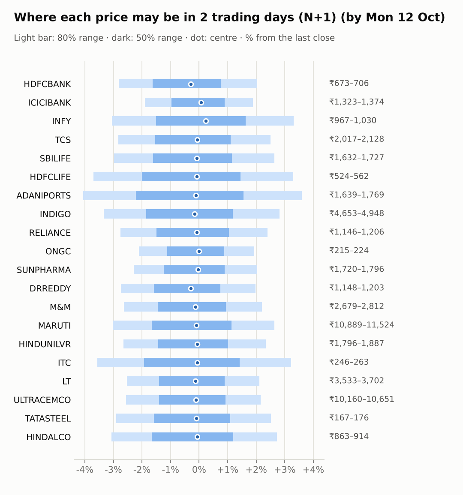
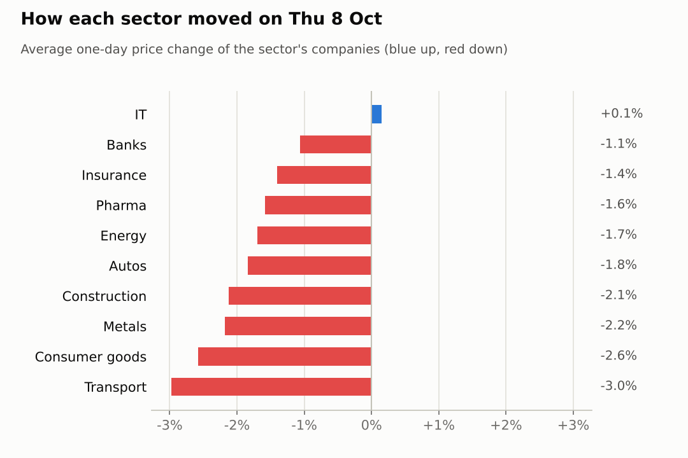

# Market brief: India (NSE), 2026-10-09

_Research log, not investment advice. Generated by a scheduled Claude Code routine._
<!-- report-data: as_of=2026-10-08 regime=CALM outcome=b11204766e49 -->

Easy-to-read version with charts and filters: [2026-10-09.html](2026-10-09.html)

## Headline
TCS reported Q2 results after the 2026-10-08 close (nse-ann-106811186), the session's main company event, after a broad sell-off that took the Nifty 50 down 1.64% with heavy foreign selling. The only call today is TCS down at N+5.

## Top 3 today
- TCS opens on its Q2 results (nse-ann-106811186) and an interim dividend (nse-ann-106811188); the forecaster calls TCS down at N+5 with confidence 0.58, mainly because the dividend goes ex inside the window.
- ITC sits at a 52-week low after the corroborated GQG block deal (1d7679f8e3fbc796); ITC fell 4.03% and its model P(up) is the lowest of the 20.
- Foreign selling continues: FII/FPI net -12,944 cr against DII net +10,703 cr on 2026-10-08, with Brent at 103.39 (+3.18%) and KOSPI -2.62% overnight.

## Yesterday
The Nifty 50 fell 1.64% to 22231.8 on 2026-10-08 and India VIX rose 9.74%; only INFY rose (+0.5%), the other 19 watchlist stocks fell.
ITC was the worst at -4.03% as GQG sold its stake in a block deal (14619d501051f9fc). Metals and autos led the fall (see the sector sections).
No ranges matured yet, so there is nothing to score.

Market on 2026-10-08: Nifty 50 22,231.80 (-1.6%) · India VIX 15.28 (+10.0%) · watchlist 1 up / 19 down · best INFY +0.5%, worst ITC -4.0%

### Ranges scored (target date –)

No ranges have matured yet.

_none_

### Calls scored

_none_

## Today (2026-10-09)

**Regime: CALM** · India VIX 15.24 (+9.7%) · benchmark 5d -1.7% · benchmark 10d vol 15.1%

| Ticker | Sector | Close | N+1 80% | N+1 50% | N+5 80% | Call | Cue | Notes |
|---|---|---|---|---|---|---|---|---|
| HDFCBANK | Banks | ₹692.25 | ₹672.79–₹706.37 | ₹680.96–₹697.53 | ₹659.16–₹718.01 | no call | -0.59% | cue -0.59% x0.5; index -0.17% expected from SPX, x beta 1.23 x0.5, own cue -0.59% net x0.5 |
| ICICIBANK | Banks | ₹1,349.00 | ₹1,323.45–₹1,374.42 | ₹1,335.91–₹1,361.05 | ₹1,302.60–₹1,391.96 | no call | +0.14% | cue +0.14% x0.5; index -0.17% expected from SPX, x beta 0.91 x0.5, own cue +0.14% net x0.5 |
| INFY | IT | ₹997.00 | ₹966.60–₹1,029.96 | ₹981.94–₹1,013.19 | ₹941.15–₹1,052.14 | no call | +0.47% | cue +0.47% x0.5; index -0.17% expected from SPX, x beta 0.67 x0.5, own cue +0.47% net x0.5 |
| TCS | IT | ₹2,076.00 | ₹2,017.24–₹2,128.06 | ₹2,044.17–₹2,098.83 | ₹1,970.70–₹2,164.71 | 5d ▼ down 58% | – | index -0.17% expected from SPX, x beta 0.75 x0.5 |
| SBILIFE | Insurance | ₹1,682.50 | ₹1,632.38–₹1,726.76 | ₹1,655.29–₹1,701.84 | ₹1,595.45–₹1,760.92 | no call | – | index -0.17% expected from SPX, x beta 0.87 x0.5 |
| HDFCLIFE | Insurance | ₹544.50 | ₹524.40–₹562.48 | ₹533.59–₹552.37 | ₹502.06–₹583.74 | no call | – | earnings in horizon (x2.0 day); index -0.17% expected from SPX, x beta 0.96 x0.5 |
| ADANIPORTS | Transport | ₹1,708.00 | ₹1,638.79–₹1,769.29 | ₹1,670.22–₹1,734.57 | ₹1,588.68–₹1,817.44 | no call | – | index -0.17% expected from SPX, x beta 1.35 x0.5 |
| INDIGO | Transport | ₹4,813.10 | ₹4,652.62–₹4,948.46 | ₹4,724.29–₹4,870.19 | ₹4,540.68–₹5,059.71 | no call | – | index -0.17% expected from SPX, x beta 1.83 x0.5 |
| RELIANCE | Energy | ₹1,178.00 | ₹1,145.61–₹1,206.24 | ₹1,160.35–₹1,190.26 | ₹1,109.73–₹1,239.88 | no call | – | earnings in horizon (x2.0 day); index -0.17% expected from SPX, x beta 0.96 x0.5 |
| ONGC | Energy | ₹219.80 | ₹215.18–₹224.05 | ₹217.35–₹221.72 | ₹211.56–₹227.12 | no call | – | index -0.17% expected from SPX, x beta 0.04 x0.5 |
| SUNPHARMA | Pharma | ₹1,759.80 | ₹1,719.54–₹1,795.65 | ₹1,738.11–₹1,775.65 | ₹1,689.22–₹1,822.67 | no call | – | index -0.17% expected from SPX, x beta 0.48 x0.5 |
| DRREDDY | Pharma | ₹1,180.00 | ₹1,147.77–₹1,203.37 | ₹1,161.31–₹1,188.73 | ₹1,125.18–₹1,222.62 | no call | -0.57% | cue -0.57% x0.5; index -0.17% expected from SPX, x beta 0.48 x0.5, own cue -0.57% net x0.5 |
| M&M | Autos | ₹2,751.20 | ₹2,678.93–₹2,811.87 | ₹2,711.30–₹2,776.87 | ₹2,628.10–₹2,861.35 | no call | – | index -0.17% expected from SPX, x beta 1.41 x0.5 |
| MARUTI | Autos | ₹11,228.00 | ₹10,888.57–₹11,523.79 | ₹11,042.74–₹11,356.03 | ₹10,642.12–₹11,756.07 | no call | – | index -0.17% expected from SPX, x beta 1.10 x0.5 |
| HINDUNILVR | Consumer goods | ₹1,844.50 | ₹1,795.61–₹1,887.49 | ₹1,817.97–₹1,863.29 | ₹1,759.51–₹1,920.64 | no call | – | index -0.17% expected from SPX, x beta 0.79 x0.5 |
| ITC | Consumer goods | ₹255.00 | ₹245.93–₹263.20 | ₹250.10–₹258.62 | ₹239.16–₹269.42 | no call | – | index -0.17% expected from SPX, x beta 0.71 x0.5 |
| LT | Construction | ₹3,625.10 | ₹3,533.34–₹3,701.53 | ₹3,574.32–₹3,657.28 | ₹3,469.22–₹3,764.35 | no call | – | index -0.17% expected from SPX, x beta 1.45 x0.5 |
| ULTRACEMCO | Construction | ₹10,426.00 | ₹10,159.93–₹10,650.94 | ₹10,279.53–₹10,521.71 | ₹9,971.14–₹10,832.58 | no call | – | index -0.17% expected from SPX, x beta 1.27 x0.5 |
| TATASTEEL | Metals | ₹171.96 | ₹166.97–₹176.30 | ₹169.24–₹173.84 | ₹163.35–₹179.70 | no call | – | index -0.17% expected from SPX, x beta 1.07 x0.5 |
| HINDALCO | Metals | ₹890.15 | ₹862.86–₹914.40 | ₹875.37–₹900.78 | ₹842.65–₹933.01 | no call | – | index -0.17% expected from SPX, x beta 0.80 x0.5 |

Evidence status of the calls (each cited id as of the call's made_at; the first is the main evidence):

- TCS 5d down: nse-ann-106811188 confirmed_primary, f1cc87d299739625 confirmed_primary, nse-ann-106811186 confirmed_primary

- TCS, N+5, down, confidence 0.58: the model's P(up) 0.4608 plus a small downward adjustment for the interim dividend, which goes ex inside the window (nse-ann-106811188, f1cc87d299739625); the Q2 results were mixed (nse-ann-106811186).
- Abstentions: every other ticker and horizon, and TCS at N+1. All model probabilities sit near or below their base rates and almost no company news is verified beyond what the model already counts.
  - ITC: the block-deal news is corroborated but already in the price.
  - LT: the confirmed order wins date from 2026-10-05 and the stock fell through them.
  - HDFCLIFE and RELIANCE: results fall inside or at the end of the N+5 window.
  - No ticker was blocked by data quality, and none has earnings within 1 day.
- AI traders (paper, separate from the brief): the Sonnet combined trader called all 20 companies down at N+1, N+3 and N+5 on the model alone; the pattern-mood trader called M&M, MARUTI and HINDALCO up as oversold bounces; the news-results trader and the Opus combined trader abstained on every company.

### Overnight cues and global factors

| Symbol | Name | Last | Change |
|---|---|---|---|
| BRENT | Brent crude | 103.39 | +3.18% |
| DXY | US dollar index | 102.00 | -0.24% |
| GOLD | Gold | 4,199.70 | +1.42% |
| HANGSENG | Hang Seng | 24,084.34 | +1.26% |
| INDIAVIX | India VIX | 15.24 | +9.74% |
| KOSPI | KOSPI | 6,625.93 | -2.62% |
| NASDAQ | Nasdaq Composite (previous US close) | 27,193.34 | -1.25% |
| NIFTY50 | Nifty 50 | 22,231.80 | -1.64% |
| NIKKEI | Nikkei 225 | 68,640.77 | -0.58% |
| SHANGHAI | Shanghai Composite | 3,789.01 | -0.60% |
| SPX | S&P 500 (previous US close) | 7,765.36 | -0.47% |
| STOXX50 | Euro Stoxx 50 | 6,133.89 | -0.75% |
| TAIWAN | Taiwan Weighted | 49,433.57 | -0.75% |
| US10Y | US 10-year yield | 5.23 | -0.87% |
| USDINR | USD/INR | 96.78 | +0.02% |
| USDJPY | USD/JPY | 157.97 | -0.06% |
| USVIX | US VIX | 15.42 | +2.25% |

### ADRs (US-listed shares, previous US session)

| Ticker | ADR | Last | Change |
|---|---|---|---|
| DRREDDY | RDY | 12.20 | -0.57% |
| HDFCBANK | HDB | 22.01 | -0.59% |
| ICICIBANK | IBN | 27.90 | +0.14% |
| INFY | INFY | 10.60 | +0.47% |

## Tomorrow and this week

| Date | Event | Type |
|---|---|---|
| 2026-10-08 | Tata Consultancy Services earnings | company |
| 2026-10-13 | Nifty weekly options expiry (Tuesday) |  |
| 2026-10-15 | HDFC Life earnings | company |
| 2026-10-16 | Reliance Industries earnings | company |
| 2026-10-17 | HDFC Bank earnings | company |
| 2026-10-17 | ICICI Bank earnings | company |
| 2026-10-19 | Nifty weekly options expiry (Tuesday) |  |
| 2026-10-19 | UltraTech Cement earnings | company |
| 2026-10-23 | Dr Reddy's earnings | company |
| 2026-10-23 | Infosys earnings | company |
| 2026-10-23 | SBI Life Insurance earnings | company |
| 2026-10-27 | NSE monthly F&O expiry (last Tuesday) | major |
| 2026-10-27 | Nifty weekly options expiry (Tuesday) |  |
| 2026-10-28 | Adani Ports earnings | company |
| 2026-10-28 | Larsen & Toubro earnings | company |
| 2026-10-29 | FOMC rate decision (previous US evening) | major |
| 2026-10-29 | Hindustan Unilever earnings | company |
| 2026-10-29 | ITC earnings | company |
| 2026-10-29 | Maruti Suzuki earnings | company |

Regime is CALM, but India VIX rose to 15.24 and FII selling has run for 4 reported days (-26,725 cr). Overnight cues are mostly weak (Nasdaq -1.25%, KOSPI -2.62%), Hang Seng +1.26% is the exception, and Brent at 103.39 weighs on airlines and oil users.
This week: Nifty weekly options expiry on 2026-10-13, then results from HDFC Life (2026-10-15), Reliance (2026-10-16) and HDFC Bank and ICICI Bank (2026-10-17).

## By sector

### Banks

HDFCBANK fell 1.49% and trails ICICIBANK by 4.39 points over 5 days; ICICIBANK held up better (d5 +2.07%). Both report on 2026-10-17.
Bull: HDFCBANK has a catch-up case at RSI 39; ICICIBANK has relative strength and its ADR rose 0.14%.
Bear: HDFCBANK's ADR fell 0.59% and its news is promotional or conflicting; the two moved apart, which points to company news rather than sector news.

### IT

Nifty IT was nearly flat (-0.08%) while the market fell. TCS slipped 0.21% before its results (nse-ann-106811186), and INFY rose 0.5%.
Bull: TCS's EPS of 38.37 came slightly above consensus; INFY's ADR rose 0.47% overnight.
Bear: the TCS margin miss and muted deals (unverified items), and US green-card news that hit both (unverified). The two moved together on sector news.

### Insurance

HDFCLIFE dipped 0.28% but is up 4.47% over 5 days; SBILIFE fell 2.53%.
Bull: HDFCLIFE has relative strength (5.29 points ahead of its peer), though its premium-growth headline is promotional.
Bear: HDFCLIFE reports on 2026-10-15 inside the window, and SBILIFE has no news; they moved apart.

### Transport

INDIGO fell 3.55% and ADANIPORTS 2.41% as the transport index fell.
Bull: INDIGO has fare strength against fuel costs (single-source items).
Bear: Brent at 103.39 raises INDIGO's fuel cost, and INDIGO's beta is 1.83; both fell together with the sector.

### Energy

RELIANCE fell 2.46% and ONGC 0.94% as the energy index fell.
Bull: ONGC's beta is 0.04 and it has a petrochemicals JV filing (nse-ann-106811021); RELIANCE's Jio IPO story is only a rumour.
Bear: RELIANCE fell on an allegations headline (unverified) and reports on 2026-10-16. Both fell with the sector.

### Pharma

DRREDDY fell 1.98% and SUNPHARMA 1.19% as the pharma index fell.
Bull: DRREDDY is up 2.52% over 20 days; SUNPHARMA has an analyst upgrade (unverified).
Bear: DRREDDY received a USFDA Form 483 (178ab25db3d3df16, promotional status). Both moved with the sector.

### Autos

M&M fell 1.74% and MARUTI 1.94% as the auto index fell; M&M is down 6.74% over 5 days.
Bull: both are deeply oversold (M&M RSI 18, MARUTI RSI 25), so a bounce is possible.
Bear: no verified company news supports a turn; both moved together with the sector.

### Consumer goods

ITC fell 4.03% on 2.95 times its usual volume after the GQG block deal (1d7679f8e3fbc796); HINDUNILVR fell 1.12%.
Bull: the block seller in ITC has finished, so the selling pressure may be over.
Bear: ITC is at a 52-week low and has the model's lowest P(up); HINDUNILVR has only a promotional target cut. ITC moved on company news.

### Construction

LT fell 2.06% and ULTRACEMCO 2.18% as the construction index fell.
Bull: LT has confirmed order wins (nse-ann-106806590) and the model's highest P(up) of the 20.
Bear: LT's orders are already priced in and its beta is 1.45; ULTRACEMCO has no verified news. Both moved with the sector.

### Metals

HINDALCO fell 2.27% and TATASTEEL 2.1% as the metals index fell.
Bull: HINDALCO is oversold at RSI 26; TATASTEEL's Q2 volume update (nse-ann-106810367) is positive but single source.
Bear: TATASTEEL is down 6.7% over 5 days and both fell with the sector.

## Track record

Ranges (targets 50% / 80%; width, score and centre error in % of price, lower is better; naive = last close ± recent typical move, no-change = last close as the centre):

_none_

Ranges by regime (since start):

_none_

Up/down calls vs the always-up baseline:

_none_

Calls by confidence band (a band should hit about as often as its confidence):

_none_

Weekly review 2026-W40: 1 proposed range change for a human to decide (low sample) · [review-2026-W40.md](review-2026-W40.md)

## Data quality

- Indicators: 20 OK, partial: none, blocked: none
- Regime notes: none

| H | Calibration | History n | Live n | q10 / q90 |
|---|---|---|---|---|
| 1d | pool | 8700 | 0 | -1.29 / 1.17 |
| 2d | pool | 8680 | 0 | -1.31 / 1.16 |
| 3d | pool | 8660 | 0 | -1.31 / 1.15 |
| 4d | pool | 8640 | 0 | -1.36 / 1.13 |
| 5d | pool | 8620 | 0 | -1.34 / 1.15 |

- validation: collect, features, context, news and forecast gates passed with no failures.
- validate report, failure UNMATCHED_NUMBER on the first attempt: sector index moves, the TCS results figures and the forecaster's adjustment in the narrative had no same-kind source; those sentences were reworded without the numbers and the gate passed on the retry.
- validate collect, warning NOT_FETCHED: NSE announcements' newest first_seen_at (2026-10-08 18:19 UTC) is not from this run.
- validate collect, warning COLLECTOR_FAILED: news feed gnews:India inflation CPI failed (HTTP 503).
- Results digest: TCS Q2 release stored as text_unavailable; its NSE attachment nse-ann-106811186 is a PDF, which is not parsed yet.
- News status: 1 primary source flagged primary_without_value.
- Head-to-head picks: lab.py pick wrote no picks (no live strategies yet).
- AI traders: every abstention has code `abstained` (news-results 20, pattern-mood 17, Opus combined 20); no gate failures, retries, timeouts or kills.
- Inbox imports: 0 company commands and 0 paper trades imported; none refused or failed.
- Article reads: unvetted outlets theunitedindian.com and upstox.com were skipped (not on the allowlist).
