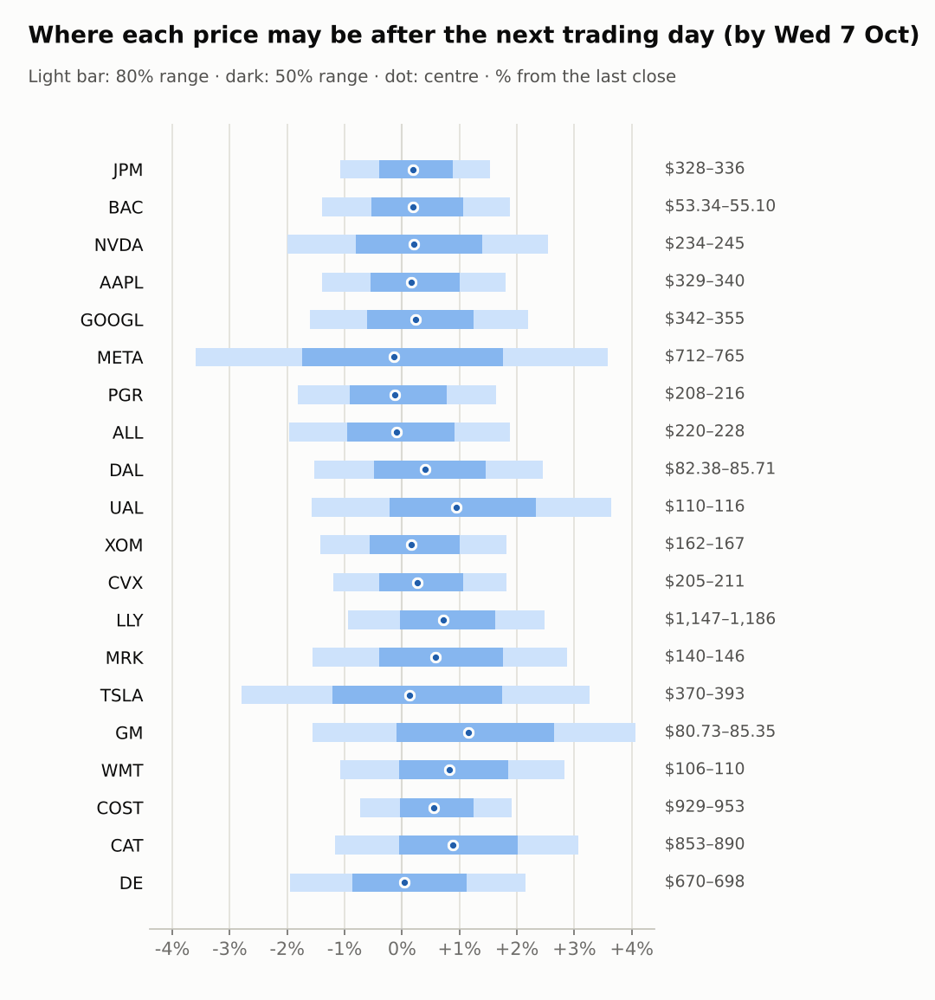
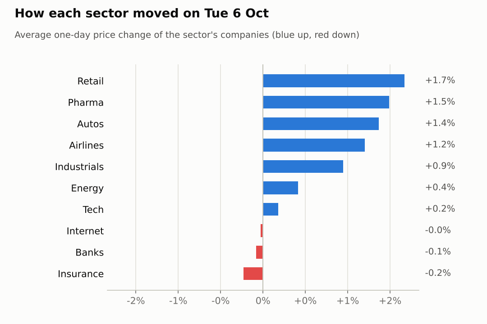

# Market brief: US (NYSE/Nasdaq), 2026-10-07

_Research log, not investment advice. Generated by a scheduled Claude Code routine._
<!-- report-data: as_of=2026-10-06 regime=TRENDING -->

Easy-to-read version with charts and filters: [2026-10-07.html](2026-10-07.html)

## Headline
No calls today: every ticker abstained because the data-collection check failed on the new earnings-estimates file, which looks like a checker false alarm, not bad prices. The market sits in a TRENDING regime with a calm VIX of 15.01, and the September CPI release on 2026-10-14 is the week's main risk.

## Top 3 today
- No up/down calls today: the collect validation gate failed (code SCHEMA) on the earnings-estimates file, so all 20 tickers abstained; price ranges are still published for all of them.
- Tesla's Q3 deliveries are confirmed by its 8-K (0001628280-26-064366); the SpaceX merger talk is only a rumour (cced5d4b933d5106).
- Earnings week for the banks: Delta reports on 2026-10-09, JPMorgan on 2026-10-13, and Bank of America and Progressive on 2026-10-14, the same day as US CPI.

## Yesterday
The S&P 500 ETF rose 0.5% on 2026-10-06 and the VIX fell 3.3%, with 16 watchlist stocks up and 4 down (d47112269b7842bc). GM was the best mover, +2.2%, even after reports of weaker Q3 US sales (9f5e926bd79c48e6); META was the worst, -0.4%. No ranges have matured yet, so there is nothing to score.

Market on 2026-10-06: S&P 500 ETF 779.09 (+0.5%) · VIX 15.01 (-3.3%) · watchlist 16 up / 4 down · best GM +2.2%, worst META -0.4%

### Ranges scored (target date –)

No ranges have matured yet.

_none_

### Calls scored

_none_

## Today (2026-10-07)

**Regime: TRENDING** · VIX 15.01 (-3.3%) · benchmark 5d +1.9% · benchmark 10d vol 8.7%

| Ticker | Sector | Close | Next day 80% | Next day 50% | 5 days 80% | Call | Cue | Notes |
|---|---|---|---|---|---|---|---|---|
| JPM | Banks | $331.28 | $327.71–$336.34 | $329.98–$334.19 | $317.38–$349.55 | no call | +0.38% | cue +0.38% x0.5; earnings in horizon (x3.0 day) |
| BAC | Banks | $54.09 | $53.34–$55.10 | $53.80–$54.66 | $52.34–$56.42 | no call | +0.39% | cue +0.39% x0.5 |
| NVDA | Tech | $239.24 | $234.47–$245.31 | $237.30–$242.59 | $228.42–$253.48 | no call | +0.40% | cue +0.40% x0.5 |
| AAPL | Tech | $333.63 | $328.97–$339.65 | $331.78–$336.99 | $322.95–$347.61 | no call | +0.32% | cue +0.32% x0.5 |
| GOOGL | Internet | $347.68 | $342.12–$355.30 | $345.58–$352.01 | $334.74–$365.17 | no call | +0.48% | cue +0.48% x0.5 |
| META | Internet | $738.88 | $712.29–$765.32 | $726.03–$751.90 | $683.35–$806.20 | no call | -0.29% | cue -0.29% x0.5 |
| PGR | Insurance | $212.05 | $208.21–$215.53 | $210.13–$213.70 | $204.09–$221.00 | no call | -0.27% | cue -0.27% x0.5 |
| ALL | Insurance | $224.27 | $219.86–$228.49 | $222.13–$226.33 | $215.03–$234.96 | no call | -0.20% | cue -0.20% x0.5 |
| DAL | Airlines | $83.66 | $82.38–$85.71 | $83.25–$84.88 | $78.46–$90.89 | no call | +0.81% | cue +0.81% x0.5; earnings in horizon (x3.0 day) |
| UAL | Airlines | $111.87 | $110.11–$115.94 | $111.63–$114.47 | $106.88–$120.35 | no call | +1.90% | cue +1.90% x0.5 |
| XOM | Energy | $164.48 | $162.15–$167.47 | $163.55–$166.14 | $159.15–$171.44 | no call | +0.31% | cue +0.31% x0.5 |
| CVX | Energy | $207.58 | $205.10–$211.35 | $206.75–$209.79 | $201.58–$215.99 | no call | +0.54% | cue +0.54% x0.5 |
| LLY | Pharma | $1,157.49 | $1,146.60–$1,186.14 | $1,156.99–$1,176.28 | $1,124.37–$1,215.65 | no call | +1.44% | cue +1.44% x0.5 |
| MRK | Pharma | $141.94 | $139.72–$146.02 | $141.37–$144.44 | $136.21–$150.76 | no call | +1.18% | cue +1.18% x0.5 |
| TSLA | Autos | $380.68 | $370.05–$393.12 | $376.06–$387.31 | $357.35–$410.74 | no call | +0.27% | cue +0.27% x0.5 |
| GM | Autos | $82.01 | $80.73–$85.35 | $81.93–$84.19 | $78.17–$88.86 | no call | +2.33% | cue +2.33% x0.5 |
| WMT | Retail | $107.20 | $106.05–$110.23 | $107.15–$109.19 | $103.90–$113.57 | no call | +2.02% | cue +2.02% x0.5 |
| COST | Retail | $935.68 | $928.90–$953.47 | $935.37–$947.36 | $915.37–$972.07 | no call | +1.19% | cue +1.19% x0.5 |
| CAT | Industrials | $863.44 | $853.42–$889.93 | $862.99–$880.80 | $833.83–$918.26 | no call | +1.99% | cue +1.99% x0.5 |
| DE | Industrials | $682.79 | $669.50–$697.50 | $676.84–$690.50 | $653.85–$718.52 | no call | +0.09% | cue +0.09% x0.5 |

No calls. Every ticker (AAPL, ALL, BAC, CAT, COST, CVX, DAL, DE, GM, GOOGL, JPM, LLY, META, MRK, NVDA, PGR, TSLA, UAL, WMT, XOM) abstained on both horizons with the reason "data failed validation": the collect gate failed with code SCHEMA on today's earnings-estimates file and named all of them. Even without the gate failure the evidence was thin: the signal model's chance of a rise was close to its base rate for every ticker, and only Tesla's deliveries (0001628280-26-064366) had confirmed main evidence. DAL also reports earnings within the 5-day horizon.

### Overnight cues and global factors

| Symbol | Name | Last | Change |
|---|---|---|---|
| DXY | US dollar index | 102.06 | +0.23% |
| ES | S&P 500 futures | 7,879.75 | +0.07% |
| GOLD | Gold | 4,168.10 | -0.45% |
| NQ | Nasdaq 100 futures | 31,479.75 | -0.01% |
| SPY | S&P 500 ETF | 779.87 | +0.65% |
| US10Y | US 10-year yield | 5.27 | -0.79% |
| VIX | VIX | 15.01 | -3.29% |
| WTI | WTI crude | 90.16 | +0.80% |

## Tomorrow and this week

| Date | Event | Type |
|---|---|---|
| 2026-10-06 | JPMorgan ex-dividend | company |
| 2026-10-09 | Delta Air Lines earnings | company |
| 2026-10-13 | JPMorgan earnings | company |
| 2026-10-14 | Bank of America earnings | company |
| 2026-10-14 | Progressive earnings | company |
| 2026-10-14 | US CPI (September) | major |
| 2026-10-15 | Delta Air Lines ex-dividend | company |
| 2026-10-16 | US monthly options expiry |  |
| 2026-10-20 | General Motors earnings | company |
| 2026-10-20 | United Airlines earnings | company |
| 2026-10-21 | Tesla earnings | company |

Key risks this week are the US CPI print on 2026-10-14 and the start of bank earnings (JPMorgan on 2026-10-13, Bank of America and Progressive on 2026-10-14), with Delta reporting first on 2026-10-09. Overnight cues are quiet: S&P 500 futures +0.07% and Nasdaq 100 futures -0.01%. The US 10-year yield (US10Y) stays high at 5.269. The regime is TRENDING with no stress flag.

## By sector

### Banks

JPM is down 6.29% and BAC down 13.3% over 20 days, so both are oversold (low RSI) and moved together with the sector ahead of earnings. Bull: an oversold bounce into JPM's 2026-10-13 and BAC's 2026-10-14 reports. Bear: earnings and CPI both land in the 5-day window, so the move could go either way.

### Tech

NVDA is up 5.29% over 5 days near its 20-day high, while AAPL lagged at +1.28%, so the two moved apart. Bull: AAPL has catch-up room and NVDA momentum holds. Bear: NVDA is stretched, and the SpaceX chip-financing story is unverified (ab389b7d388dcec8).

### Internet

GOOGL rose 1.98% over 5 days while META was flat (+0.01%), so they moved apart on company news. Bull: GOOGL's last quarter was strong. Bear: GOOGL faces class-action headlines that are promotional (f319957f99648a0a), and META an EU fine threat from a single source (6405e269ded661ea), with META up 20.44% over 20 days.

### Insurance

ALL is down 11.52% over 20 days while PGR is down only 1.33%, so they moved apart. Bull: ALL looks oversold. Bear: PGR reports on 2026-10-14, the same day as CPI, and ALL has no catalyst.

### Airlines

UAL rose 1.7% and DAL 0.7% on the day, moving together with the sector. Bull: Delta's 2026-10-09 earnings could lift airline sentiment. Bear: Delta's report is a coin flip, and UAL had an app outage headline (897fac6461319c14).

### Energy

XOM is up 1.94% and CVX 1.57% over 5 days with WTI crude at 90.16, moving together on oil. Bull: firm oil prices. Bear: thin trading volume and an extended sector move.

### Pharma

LLY rose 1.26% and MRK 1.72% on the day after weaker weeks (MRK -4.92% over 5 days), moving together. Bull: rebound after the sector selloff. Bear: the sector ETF is still weak and the news is unverified (84794da34c0f4929, 9cb43a08ebe8831b).

### Autos

TSLA is up 7.89% over 5 days after confirmed Q3 deliveries (0001628280-26-064366), while GM rose 2.22% on the day despite weaker Q3 US sales (9f5e926bd79c48e6), so they moved apart. Bull: GM's bad news looks priced in. Bear: TSLA's run is stretched, and the SpaceX merger talk is only a rumour (cced5d4b933d5106).

### Retail

WMT rose 2.03% and COST 1.32% on the day, moving together with consumer staples. Bull: steady demand, with COST at its 20-day high. Bear: both short-term runs look stretched, with no news behind them.

### Industrials

CAT is up 4.45% over 5 days while DE is up only 0.34%, so they moved apart. Bull: CAT has strong momentum and DE has catch-up room. Bear: CAT's quick run looks stretched, and DE shows selling pressure (falling on-balance volume).

## Track record

Ranges (targets 50% / 80%; width, score and centre error in % of price, lower is better; naive = last close ± recent typical move, no-change = last close as the centre):

_none_

Ranges by regime (since start):

_none_

Up/down calls vs the always-up baseline:

_none_

Calls by confidence band (a band should hit about as often as its confidence):

_none_

Weekly review 2026-W40: 0 proposed range changes for a human to decide (low sample) · [review-2026-W40.md](review-2026-W40.md)

## Data quality

- Indicators: 20 OK, partial: none, blocked: none
- Regime notes: none

| H | Calibration | History n | Live n | q10 / q90 |
|---|---|---|---|---|
| 1d | pool | 8800 | 0 | -1.16 / 1.20 |
| 5d | pool | 8720 | 0 | -1.13 / 1.30 |

- validation: collect, SCHEMA (blocking, failed again on retry): data/us/earnings_estimates/2026/10/2026-10-07.jsonl, report_at values (scheduled earnings report times) are later than the run time; all 20 tickers (AAPL, ALL, BAC, CAT, COST, CVX, DAL, DE, GM, GOOGL, JPM, LLY, META, MRK, NVDA, PGR, TSLA, UAL, WMT, XOM). Dropped: every call (all tickers abstained, "data failed validation"). Likely a gate false positive on a future-dated field; needs a code fix.
- validation: features, context, news, forecast passed with no warnings.
- collect_holdings: SEC acceptance times of four 13F filer CIKs unverified (no ACCEPTANCE-DATETIME in their oldest filing), stored as served, maybe 4-5h late.
- collect_macro: note, the Cboe put/call file for today is published after the close.
- collect_shorts: note, the FINRA short-sale volume file for today is published after the close.
- collect_articles: most material headlines came from unvetted outlets (skipped_unlisted) or outlets that block readers, so few articles were read and most news events are unverified or promotional.
- Lessons: no settled calls yet, nothing to reflect on.
- Neo4j sync: ok.
