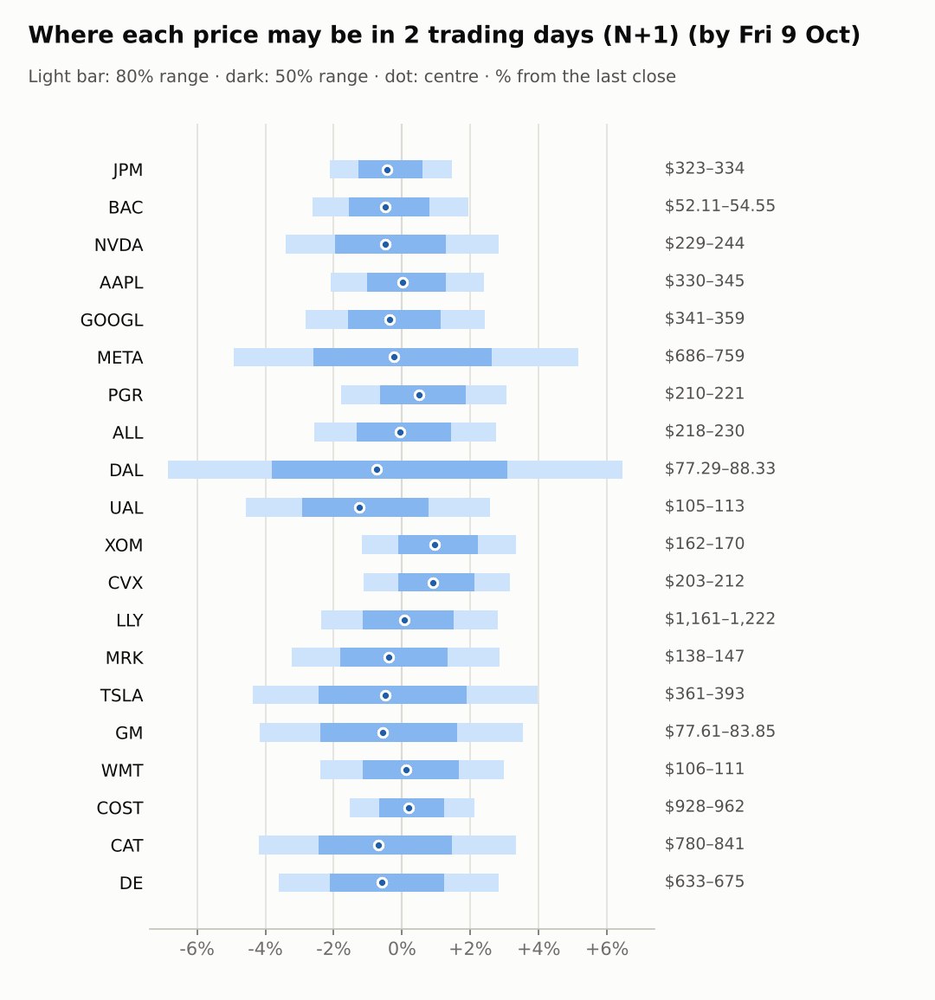
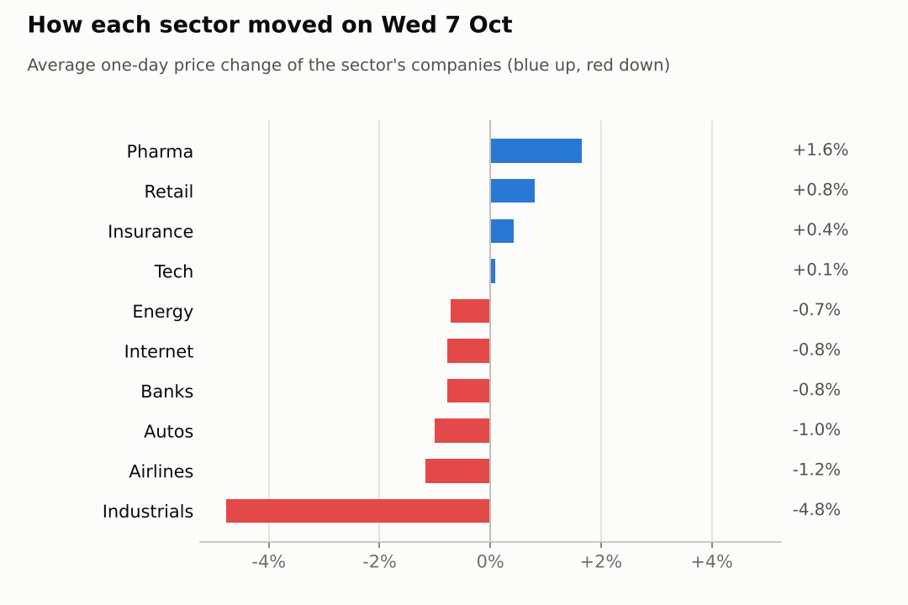
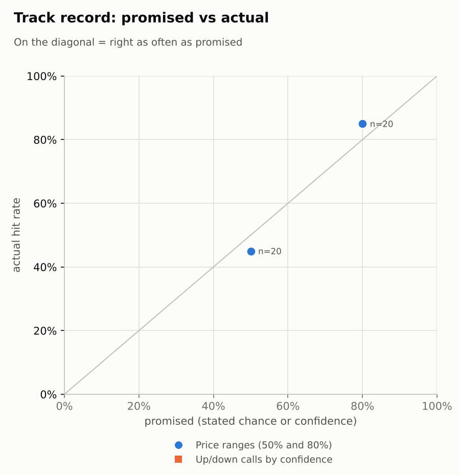

# Market brief: US (NYSE/Nasdaq), 2026-10-08

_Research log, not investment advice. Generated by a scheduled Claude Code routine._
<!-- report-data: as_of=2026-10-07 regime=TRENDING outcome=dfdd81249c34 -->

Easy-to-read version with charts and filters: [2026-10-08.html](2026-10-08.html)

## Headline
US futures point lower before the 2026-10-08 open (S&P 500 futures -0.49%, Nasdaq 100 futures -0.73%) as WTI crude jumps 4.77% and the VIX rises to 15.9. Only one call today: NVDA up over 5 sessions, on the corroborated SpaceX chip-financing report (ab389b7d388dcec8).

## Top 3 today
- NVDA: SpaceX is reported to seek $40 billion of financing to buy Nvidia chips, corroborated by 3 independent outlets; the only call today, up at N+5 (ab389b7d388dcec8).
- Oil and rates: WTI crude +4.77% to 92.49 and the US 10-year yield at 5.277 weigh on futures; energy names XOM (+2.1%) and CVX (+1.94%) are up pre-market, airlines UAL (-2.47%) and DAL (-1.47%) down.
- Earnings ahead: DAL reports on 2026-10-09 (no call allowed), JPM on 2026-10-13, BAC and PGR on 2026-10-14, the same day as September CPI.

## Yesterday
On 2026-10-07 the S&P 500 ETF slipped 0.2% and 13 of 20 watchlist stocks fell. CAT (-5.75%) and DE (-3.8%) led the losses as industrials sold off with long yields high and a federal farm-equipment antitrust probe was reported (promotional-source items only). LLY gained 2.7% as health care was the one sector ETF up.
The next-day 80% ranges held 17 of 20 closes, the same as the naive range; the three misses were CAT and DE (falls far larger than a normal day) and LLY (a rise above its range). The 50% ranges held only 9 of 20, below their 50% target.

Market on 2026-10-07: S&P 500 ETF 777.22 (-0.2%) · VIX 15.08 (+0.5%) · watchlist 7 up / 13 down · best LLY +2.7%, worst CAT -5.7%

### Ranges scored (target date 2026-10-07)

next-day ranges: **80% hit 17/20** (naive 17/20) · 50% hit 9/20

| Ticker | 80% range | 50% range | Actual | 80% | 50% | Naive 80% |
|---|---|---|---|---|---|---|
| AAPL | $328.97–$339.65 | $331.78–$336.99 | $336.67 | ✅ | ✅ | ✅ |
| ALL | $219.86–$228.49 | $222.13–$226.33 | $223.95 | ✅ | ✅ | ✅ |
| BAC | $53.34–$55.10 | $53.80–$54.66 | $53.52 | ✅ | ❌ | ✅ |
| CAT | $853.42–$889.93 | $862.99–$880.80 | $813.83 | ❌ | ❌ | ❌ |
| COST | $928.90–$953.47 | $935.37–$947.36 | $942.25 | ✅ | ✅ | ✅ |
| CVX | $205.10–$211.35 | $206.75–$209.79 | $205.15 | ✅ | ❌ | ✅ |
| DAL | $82.38–$85.71 | $83.25–$84.88 | $82.97 | ✅ | ❌ | ✅ |
| DE | $669.50–$697.50 | $676.84–$690.50 | $656.87 | ❌ | ❌ | ❌ |
| GM | $80.73–$85.35 | $81.93–$84.19 | $80.99 | ✅ | ❌ | ✅ |
| GOOGL | $342.12–$355.30 | $345.58–$352.01 | $350.50 | ✅ | ✅ | ✅ |
| JPM | $327.71–$336.34 | $329.98–$334.19 | $329.58 | ✅ | ❌ | ✅ |
| LLY | $1,146.60–$1,186.14 | $1,156.99–$1,176.28 | $1,188.72 | ❌ | ❌ | ❌ |
| META | $712.29–$765.32 | $726.03–$751.90 | $721.31 | ✅ | ❌ | ✅ |
| MRK | $139.72–$146.02 | $141.37–$144.44 | $142.79 | ✅ | ✅ | ✅ |
| NVDA | $234.47–$245.31 | $237.30–$242.59 | $237.47 | ✅ | ✅ | ✅ |
| PGR | $208.21–$215.53 | $210.13–$213.70 | $214.12 | ✅ | ❌ | ✅ |
| TSLA | $370.05–$393.12 | $376.06–$387.31 | $377.81 | ✅ | ✅ | ✅ |
| UAL | $110.11–$115.94 | $111.63–$114.47 | $110.17 | ✅ | ❌ | ✅ |
| WMT | $106.05–$110.23 | $107.15–$109.19 | $108.16 | ✅ | ✅ | ✅ |
| XOM | $162.15–$167.47 | $163.55–$166.14 | $164.05 | ✅ | ✅ | ✅ |

### Calls scored

_none_

## Today (2026-10-08)

**Regime: TRENDING** · VIX 15.90 (+5.4%) · benchmark 5d +1.9% · benchmark 10d vol 7.8%

| Ticker | Sector | Close | N+1 80% | N+1 50% | N+5 80% | Call | Cue | Notes |
|---|---|---|---|---|---|---|---|---|
| JPM | Banks | $329.58 | $322.58–$334.43 | $325.37–$331.52 | $311.82–$348.90 | no call | -0.86% | cue -0.86% x0.5; earnings in horizon (x3.0 day); major event x1.15 |
| BAC | Banks | $53.52 | $52.11–$54.55 | $52.69–$53.95 | $49.92–$57.56 | no call | -0.97% | cue -0.97% x0.5; earnings in horizon (x3.0 day); major event x1.15 |
| NVDA | Tech | $237.47 | $229.38–$244.18 | $232.83–$240.51 | $223.28–$253.66 | 5d ▲ up 55% | -0.98% | cue -0.98% x0.5; major event x1.15 |
| AAPL | Tech | $336.67 | $329.68–$344.72 | $333.21–$341.02 | $323.10–$353.89 | no call | +0.05% | cue +0.05% x0.5; major event x1.15 |
| GOOGL | Internet | $350.50 | $340.64–$358.99 | $344.94–$354.45 | $332.66–$370.24 | no call | -0.71% | cue -0.71% x0.5; major event x1.15 |
| META | Internet | $721.31 | $685.84–$758.60 | $702.57–$740.29 | $655.30–$804.94 | no call | -0.49% | cue -0.49% x0.5; major event x1.15 |
| PGR | Insurance | $214.12 | $210.28–$220.68 | $212.72–$218.11 | $200.95–$233.55 | no call | +0.98% | cue +0.98% x0.5; earnings in horizon (x3.0 day); major event x1.15 |
| ALL | Insurance | $223.95 | $218.22–$230.10 | $221.00–$227.16 | $213.05–$237.39 | no call | -0.14% | cue -0.14% x0.5; major event x1.15 |
| DAL | Airlines | $82.97 | $77.29–$88.33 | $79.80–$85.52 | $75.99–$90.18 | no call | -1.47% | cue -1.47% x0.5; earnings in horizon (x3.0 day); earnings in horizon (x3.29 day, 7 past moves, median 4.2%); ex-dividend 0.215 (0.26%); major event x1.15 |
| UAL | Airlines | $110.17 | $105.13–$112.99 | $106.96–$111.04 | $101.77–$117.89 | no call | -2.47% | cue -2.47% x0.5; major event x1.15 |
| XOM | Energy | $164.05 | $162.13–$169.51 | $163.86–$167.69 | $159.06–$174.18 | no call | +2.10% | cue +2.10% x0.5; major event x1.15 |
| CVX | Energy | $205.15 | $202.86–$211.65 | $204.92–$209.48 | $199.15–$217.14 | no call | +1.94% | cue +1.94% x0.5; major event x1.15 |
| LLY | Pharma | $1,188.72 | $1,160.56–$1,221.96 | $1,174.94–$1,206.79 | $1,133.83–$1,259.57 | no call | +0.11% | cue +0.11% x0.5; major event x1.15 |
| MRK | Pharma | $142.79 | $138.18–$146.85 | $140.20–$144.70 | $134.43–$152.21 | no call | -0.77% | cue -0.77% x0.5; major event x1.15 |
| TSLA | Autos | $377.81 | $361.33–$392.80 | $368.62–$384.93 | $347.95–$412.57 | no call | -0.97% | cue -0.97% x0.5; major event x1.15 |
| GM | Autos | $80.99 | $77.61–$83.85 | $79.06–$82.30 | $74.95–$87.75 | no call | -1.16% | cue -1.16% x0.5; major event x1.15 |
| WMT | Retail | $108.16 | $105.56–$111.39 | $106.93–$109.95 | $103.03–$114.96 | no call | +0.25% | cue +0.25% x0.5; major event x1.15 |
| COST | Retail | $942.25 | $927.92–$962.32 | $936.03–$953.87 | $912.78–$983.14 | no call | +0.40% | cue +0.40% x0.5; major event x1.15 |
| CAT | Industrials | $813.83 | $779.77–$840.88 | $793.96–$825.65 | $753.63–$879.03 | no call | -1.36% | cue -1.36% x0.5; major event x1.15 |
| DE | Industrials | $656.87 | $633.12–$675.48 | $642.99–$664.96 | $614.86–$701.70 | no call | -1.20% | cue -1.20% x0.5; major event x1.15 |

Evidence status of the calls (each cited id as of the call's made_at; the first is the main evidence):

- NVDA 5d up: ab389b7d388dcec8 corroborated, 2401de35ebdcf08e corroborated, 60c328c71638471f corroborated

- NVDA N+5 up, confidence 0.55: the SpaceX chip-financing report is corroborated (ab389b7d388dcec8, 2401de35ebdcf08e, 60c328c71638471f); the signal model's P(up) of 0.5663 was adjusted down slightly because NVDA already closed -0.74% on 2026-10-07 with the story public.
- NVDA N+1: abstain, futures point lower and the news is largely absorbed.
- DAL: no call, hard block (earnings on 2026-10-09, within 1 day).
- JPM, BAC, PGR: abstain, earnings fall inside the 5-day window and no news qualifies as main evidence.
- TSLA: abstain, the deliveries 8-K (0001628280-26-064366) is confirmed but already in the price.
- CVX: abstain, the confirmed Hess Midstream 8-K (0000093410-26-000192) gives no clear direction and the oil jump is already in the opening price.
- MRK, DE, CAT, COST, LLY, GOOGL, META: abstain, their news is promotional-source only.
- AAPL, ALL, GM, UAL, WMT, XOM: abstain, no news that can serve as main evidence and the model sits near its base rate.

### Overnight cues and global factors

| Symbol | Name | Last | Change |
|---|---|---|---|
| DAX | DAX | 24,815.49 | -1.15% |
| DXY | US dollar index | 102.44 | +0.20% |
| ES | S&P 500 futures | 7,814.00 | -0.49% |
| FTSE | FTSE 100 | 10,417.08 | -0.40% |
| GOLD | Gold | 4,147.30 | +0.16% |
| HANGSENG | Hang Seng | 23,785.79 | -1.43% |
| KOSPI | KOSPI | 6,625.93 | -2.62% |
| NIKKEI | Nikkei 225 | 69,221.06 | -1.16% |
| NQ | Nasdaq 100 futures | 31,173.50 | -0.73% |
| SPY | S&P 500 ETF | 773.91 | -0.43% |
| STOXX50 | Euro Stoxx 50 | 6,102.95 | -1.25% |
| US10Y | US 10-year yield | 5.28 | +0.15% |
| USDCNY | USD/CNY | 6.69 | -0.16% |
| USDJPY | USD/JPY | 158.24 | -0.04% |
| VIX | VIX | 15.90 | +5.44% |
| WTI | WTI crude | 92.49 | +4.77% |

## Tomorrow and this week

| Date | Event | Type |
|---|---|---|
| 2026-10-09 | Delta Air Lines earnings | company |
| 2026-10-13 | JPMorgan earnings | company |
| 2026-10-14 | Bank of America earnings | company |
| 2026-10-14 | Progressive earnings | company |
| 2026-10-14 | US CPI (September) | major |
| 2026-10-15 | Delta Air Lines ex-dividend | company |
| 2026-10-16 | US monthly options expiry |  |
| 2026-10-20 | General Motors earnings | company |
| 2026-10-20 | United Airlines earnings | company |
| 2026-10-21 | Tesla earnings | company |
| 2026-10-28 | Alphabet earnings | company |
| 2026-10-28 | FOMC rate decision | major |
| 2026-10-28 | Meta Platforms earnings | company |

Key risks: DAL earnings on 2026-10-09 open the bank and airline reporting season, with JPM on 2026-10-13 and BAC, PGR and September CPI on 2026-10-14. Overnight, Asia and Europe fell (KOSPI -2.62%, Euro Stoxx 50 -1.25%) and WTI crude rose 4.77%, so a weak, oil-led open is the base case. The regime is TRENDING with no stress flag; a further rise in long yields is the main threat to that.

## By sector

### Banks

JPM and BAC both fell on 2026-10-07 (JPM -0.51%, BAC -1.05%) and both are down pre-market, a sector move. Bull: both are oversold (BAC RSI 24, JPM RSI 32) ahead of earnings. Bear: 20-day losses of 14.6% for BAC and 7.08% for JPM show a downtrend, and earnings on 2026-10-13 and 2026-10-14 add event risk.

### Tech

NVDA (-0.74%) and AAPL (+0.91%) moved apart on 2026-10-07, so company news matters more. Bull: NVDA has the corroborated SpaceX financing report (ab389b7d388dcec8). Bear: NVDA's RSI of 64 and its 3.98% 5-day gain mean much may be priced, and Nasdaq 100 futures are -0.73%.

### Internet

GOOGL rose 0.81% while META fell 2.38% on 2026-10-07, company-specific moves. Bull: both are up over 20 days (META +10.34%, GOOGL +6.0%). Bear: both point lower pre-market (GOOGL -0.71%, META -0.49%) and their news is promotional only.

### Insurance

PGR (+0.98%) and ALL (-0.14%) moved apart on 2026-10-07. Bull: ALL is oversold (RSI 29) after a 20-day fall of 11.68%. Bear: PGR reports on 2026-10-14, and ALL's news is analyst target cuts from promotional-source items.

### Airlines

DAL (-0.82%) and UAL (-1.52%) fell together on 2026-10-07 with the airline ETF JETS down 1.53%, a sector move. Bull: none with verified evidence. Bear: oil up 4.77% overnight hits fuel costs, UAL is -2.47% pre-market, and DAL reports on 2026-10-09.

### Energy

CVX (-1.17%) and XOM (-0.26%) both fell on 2026-10-07, but both are up pre-market (XOM +2.1%, CVX +1.94%) with WTI crude at 92.49. Bull: higher oil, and CVX's confirmed Hess Midstream 8-K (0000093410-26-000192). Bear: the oil jump is already in the pre-market price a call would buy at.

### Pharma

LLY rose 2.7% and MRK 0.6% on 2026-10-07, with the health care ETF XLV up 1.03%. Bull: LLY trades at 0.978 of its 20-day high on deal and approval headlines (promotional-source items). Bear: MRK faces a reported Keytruda injunction in the Netherlands (promotional-source items) and is -0.77% pre-market.

### Autos

TSLA (-0.75%) and GM (-1.24%) both fell on 2026-10-07 and are both down pre-market. Bull: TSLA's Q3 deliveries 8-K is confirmed (0001628280-26-064366) and GM is up 5.18% over 5 days. Bear: TSLA has gained 6.48% over 5 days, so the delivery beat looks priced, and its merger talk is rumour only.

### Retail

COST (+0.7%) and WMT (+0.9%) rose together on 2026-10-07, a defensive sector move. Bull: both are up pre-market (COST +0.4%, WMT +0.25%) while futures fall. Bear: COST is at 0.993 of its 20-day high with RSI 61, leaving little room, and the news is promotional only.

### Industrials

CAT (-5.75%) and DE (-3.8%) fell together on 2026-10-07 as the industrials ETF XLI dropped 2.18%, a sector move tied to high long yields and the farm-equipment probe reports (promotional-source items). Bull: a one-day drop that large can rebound. Bear: both are lower again pre-market (CAT -1.36%, DE -1.2%).

## Track record

Ranges (targets 50% / 80%; width, score and centre error in % of price, lower is better; naive = last close ± recent typical move, no-change = last close as the centre):

| H | Window | n | 50% cover | 80% cover | Naive 80% | Width | Naive width | Score | Naive score | Centre err | No-change err |
|---|---|---|---|---|---|---|---|---|---|---|---|
| 1d legacy_cc | since start | 20 | 45% | 85% | 85% | 4.09 | 4.18 | 7.414 | 7.632 | 1.45 | 1.39 |
| 1d legacy_cc | last 30 days | 20 | 45% | 85% | 85% | 4.09 | 4.18 | 7.414 | 7.632 | 1.45 | 1.39 |

Ranges by regime (since start):

| H | Regime | n | 50% cover | 80% cover | Naive 80% |
|---|---|---|---|---|---|
| 1d legacy_cc | TRENDING | 20 | 45% | 85% | 85% |

Up/down calls vs the always-up baseline:

_none_

Calls by confidence band (a band should hit about as often as its confidence):

_none_

Weekly review 2026-W40: 0 proposed range changes for a human to decide (low sample) · [review-2026-W40.md](review-2026-W40.md)

## Data quality

- Indicators: 20 OK, partial: none, blocked: none
- Regime notes: none

| H | Calibration | History n | Live n | q10 / q90 |
|---|---|---|---|---|
| 1d | pool | 8800 | 0 | -1.13 / 1.24 |
| 2d | pool | 8780 | 0 | -1.14 / 1.30 |
| 3d | pool | 8760 | 0 | -1.12 / 1.30 |
| 4d | pool | 8740 | 0 | -1.13 / 1.30 |
| 5d | pool | 8720 | 0 | -1.10 / 1.33 |

- Collect: the PR Newswire feed failed (HTTP 503); validate collect warning COLLECTOR_FAILED (news: 1 failed: PR Newswire), no tickers affected.
- SEC acceptance times unverified (stored as served, maybe 4-5h late) for company CIKs 19617 and 70858 (mixed files) and 13F filer CIKs 933478, 1167483, 1040273 and 1029160 (no ACCEPTANCE-DATETIME header); 13 company CIKs ok, 6 shifted and corrected.
- News verification: 23 article candidates, 17 skipped as unlisted outlets, 4 blocked, 2 read in full; 23 claims stored; results digests: none due.
- Lessons: no settled calls to reflect on.
- AI traders: all four ran after the published ranges and passed their gate on the first attempt. Abstention codes used: abstained (no edge or no verified evidence) and earnings_window (DAL) for every trader; no gate_failed, timeout or killed. A first trader launch before the ranges were published was stopped and discarded (nothing stored).
- Validation: all other gates passed (collect, features, context, news, forecast, debate record).
