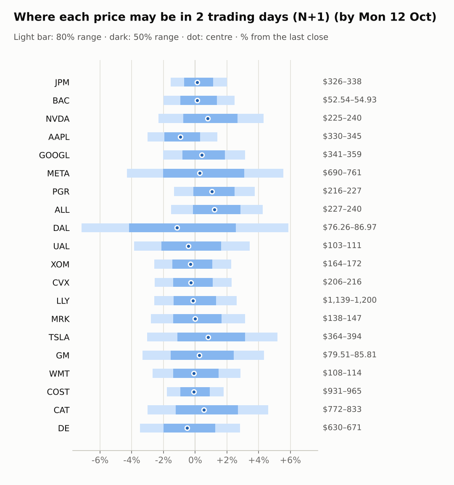
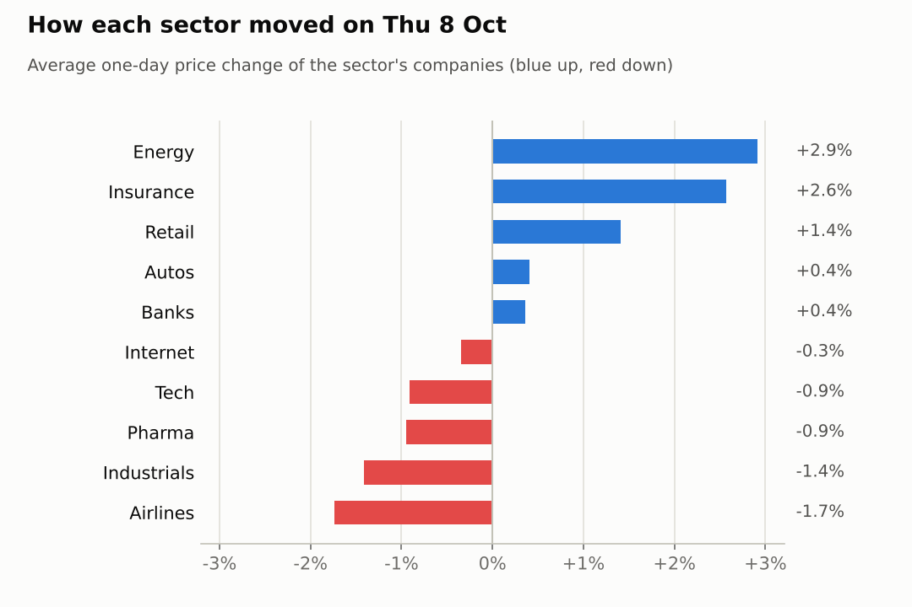

# Market brief: US (NYSE/Nasdaq), 2026-10-09

_Research log, not investment advice. Generated by a scheduled Claude Code routine._
<!-- report-data: as_of=2026-10-08 regime=CALM outcome=3c2bfb4524ce -->

Easy-to-read version with charts and filters: [2026-10-09.html](2026-10-09.html)

## Headline
Pre-market cues are mildly positive (S&P 500 futures +0.39%, Nasdaq 100 futures +0.8%) in a CALM regime, but Delta reports today and cut its 2026 forecast on fuel costs (68e4ba9e79e19aef), and AAPL is -2.2% pre-market on an iPhone order-cut report that is only a rumour (7083623705480959).

## Top 3 today
- NVDA is the only call: up at N+5, confidence 0.54, anchored on the signal model and backed by the corroborated SpaceX chip-financing story (ab389b7d388dcec8).
- DAL reports today and cut its 2026 forecast on a fuel surge (68e4ba9e79e19aef); no call is allowed on an earnings day and its ranges are widened.
- AAPL is -2.2% pre-market on reports of iPhone 18 Pro order cuts (7083623705480959), an event with rumour status only, so it supports no call.

## Yesterday
On 2026-10-08 energy led the watchlist (CVX +3.12%, XOM +2.71%) while NVDA fell 2.94%, the worst move. CVX has a confirmed_primary 8-K on its Hess Midstream restructuring (0000093410-26-000192).
The next-day ranges for 2026-10-07 covered 17 of 20 closes at 80%, the same as the naive band. CAT, DE and LLY missed: CAT and DE fell far below their bands and LLY closed just above its band.

Market on 2026-10-08: S&P 500 ETF 773.93 (-0.4%) · VIX 15.41 (+2.2%) · watchlist 10 up / 10 down · best CVX +3.1%, worst NVDA -2.9%

### Ranges scored (target date 2026-10-07)

next-day ranges: **80% hit 17/20** (naive 17/20) · 50% hit 9/20

| Ticker | 80% range | 50% range | Actual | 80% | 50% | Naive 80% |
|---|---|---|---|---|---|---|
| AAPL | $328.97–$339.65 | $331.78–$336.99 | $336.67 | ✅ | ✅ | ✅ |
| ALL | $219.86–$228.49 | $222.13–$226.33 | $223.95 | ✅ | ✅ | ✅ |
| BAC | $53.34–$55.10 | $53.80–$54.66 | $53.52 | ✅ | ❌ | ✅ |
| CAT | $853.42–$889.93 | $862.99–$880.80 | $813.83 | ❌ | ❌ | ❌ |
| COST | $928.90–$953.47 | $935.37–$947.36 | $942.25 | ✅ | ✅ | ✅ |
| CVX | $205.10–$211.35 | $206.75–$209.79 | $205.15 | ✅ | ❌ | ✅ |
| DAL | $82.38–$85.71 | $83.25–$84.88 | $82.97 | ✅ | ❌ | ✅ |
| DE | $669.50–$697.50 | $676.84–$690.50 | $656.87 | ❌ | ❌ | ❌ |
| GM | $80.73–$85.35 | $81.93–$84.19 | $80.99 | ✅ | ❌ | ✅ |
| GOOGL | $342.12–$355.30 | $345.58–$352.01 | $350.50 | ✅ | ✅ | ✅ |
| JPM | $327.71–$336.34 | $329.98–$334.19 | $329.58 | ✅ | ❌ | ✅ |
| LLY | $1,146.60–$1,186.14 | $1,156.99–$1,176.28 | $1,188.72 | ❌ | ❌ | ❌ |
| META | $712.29–$765.32 | $726.03–$751.90 | $721.31 | ✅ | ❌ | ✅ |
| MRK | $139.72–$146.02 | $141.37–$144.44 | $142.79 | ✅ | ✅ | ✅ |
| NVDA | $234.47–$245.31 | $237.30–$242.59 | $237.47 | ✅ | ✅ | ✅ |
| PGR | $208.21–$215.53 | $210.13–$213.70 | $214.12 | ✅ | ❌ | ✅ |
| TSLA | $370.05–$393.12 | $376.06–$387.31 | $377.81 | ✅ | ✅ | ✅ |
| UAL | $110.11–$115.94 | $111.63–$114.47 | $110.17 | ✅ | ❌ | ✅ |
| WMT | $106.05–$110.23 | $107.15–$109.19 | $108.16 | ✅ | ✅ | ✅ |
| XOM | $162.15–$167.47 | $163.55–$166.14 | $164.05 | ✅ | ✅ | ✅ |

### Calls scored

_none_

## Today (2026-10-09)

**Regime: CALM** · VIX 15.17 (-1.6%) · benchmark 5d +1.3% · benchmark 10d vol 8.2%

| Ticker | Sector | Close | N+1 80% | N+1 50% | N+5 80% | Call | Cue | Notes |
|---|---|---|---|---|---|---|---|---|
| JPM | Banks | $331.42 | $326.30–$338.05 | $329.09–$335.17 | $315.73–$352.38 | no call | +0.26% | cue +0.26% x0.5; earnings in horizon (x3.0 day); major event x1.15 |
| BAC | Banks | $53.61 | $52.54–$54.93 | $53.11–$54.35 | $50.41–$57.88 | no call | +0.22% | cue +0.22% x0.5; earnings in horizon (x3.0 day); major event x1.15 |
| NVDA | Tech | $230.48 | $225.13–$240.40 | $228.72–$236.62 | $218.90–$250.13 | 5d ▲ up 54% | +1.57% | cue +1.57% x0.5; major event x1.15 |
| AAPL | Tech | $340.42 | $330.21–$345.18 | $333.75–$341.50 | $323.16–$353.65 | no call | -2.20% | cue -2.20% x0.5; major event x1.15 |
| GOOGL | Internet | $348.29 | $341.25–$359.21 | $345.49–$354.78 | $333.55–$370.21 | no call | +0.81% | cue +0.81% x0.5; major event x1.15 |
| META | Internet | $720.89 | $689.84–$760.92 | $706.33–$743.09 | $660.39–$806.09 | no call | +0.55% | cue +0.55% x0.5; major event x1.15 |
| PGR | Insurance | $218.73 | $215.83–$226.92 | $218.45–$224.18 | $206.02–$240.70 | no call | +2.15% | cue +2.15% x0.5; earnings in horizon (x3.0 day); major event x1.15 |
| ALL | Insurance | $230.63 | $227.15–$240.47 | $230.29–$237.18 | $222.07–$249.34 | no call | +2.98% | cue +2.98% x0.5; major event x1.15 |
| DAL | Airlines | $82.14 | $76.26–$86.97 | $78.71–$84.25 | $75.04–$88.76 | no call | -2.30% | cue -2.30% x0.5; earnings in horizon (x3.0 day); earnings in horizon (x3.29 day, 7 past moves, median 4.2%); ex-dividend 0.215 (0.26%); major event x1.15 |
| UAL | Airlines | $107.44 | $103.31–$111.14 | $105.14–$109.19 | $100.00–$116.02 | no call | -0.87% | cue -0.87% x0.5; major event x1.15 |
| XOM | Energy | $168.50 | $164.15–$172.33 | $166.08–$170.31 | $160.64–$177.32 | no call | -0.59% | cue -0.59% x0.5; major event x1.15 |
| CVX | Energy | $211.55 | $206.17–$216.40 | $208.59–$213.88 | $201.78–$222.64 | no call | -0.53% | cue -0.53% x0.5; major event x1.15 |
| LLY | Pharma | $1,169.60 | $1,139.36–$1,200.05 | $1,153.69–$1,185.08 | $1,113.35–$1,237.23 | no call | -0.29% | cue -0.29% x0.5; major event x1.15 |
| MRK | Pharma | $142.38 | $138.40–$146.85 | $140.39–$144.76 | $134.80–$152.06 | no call | -0.02% | cue -0.02% x0.5; major event x1.15 |
| TSLA | Autos | $375.00 | $363.61–$394.46 | $370.81–$386.77 | $350.66–$413.82 | no call | +1.61% | cue +1.61% x0.5; major event x1.15 |
| GM | Autos | $82.25 | $79.51–$85.81 | $80.98–$84.24 | $76.86–$89.75 | no call | +0.50% | cue +0.50% x0.5; major event x1.15 |
| WMT | Retail | $110.56 | $107.59–$113.71 | $109.03–$112.20 | $104.98–$117.47 | no call | -0.17% | cue -0.17% x0.5; major event x1.15 |
| COST | Retail | $947.92 | $930.96–$964.85 | $939.01–$956.54 | $916.27–$985.34 | no call | -0.20% | cue -0.20% x0.5; major event x1.15 |
| CAT | Industrials | $796.18 | $772.17–$832.80 | $786.36–$817.71 | $746.64–$870.64 | no call | +1.09% | cue +1.09% x0.5; major event x1.15 |
| DE | Industrials | $652.58 | $629.89–$670.99 | $639.55–$660.81 | $612.41–$696.40 | no call | -1.05% | cue -1.05% x0.5; major event x1.15 |

Evidence status of the calls (each cited id as of the call's made_at; the first is the main evidence):

- NVDA 5d up: ab389b7d388dcec8 corroborated, 2401de35ebdcf08e corroborated, 60c328c71638471f corroborated

- NVDA N+5 up, confidence 0.54: the model's P(up) of 0.5573 minus 0.02, because the corroborated SpaceX chip-financing story (ab389b7d388dcec8, 2401de35ebdcf08e, 60c328c71638471f) is two sessions old and NVDA still fell 2.94% on 2026-10-08.
- NVDA N+1: abstain, the model's P(up) is close to its base rate.
- DAL: no call, it reports earnings today (days to earnings 0).
- AAPL: abstain, the order-cut report is a rumour (7083623705480959).
- BAC, JPM, PGR: abstain, earnings fall inside the 5-day window and there is no verified news.
- MRK: abstain, the injunction and FDA headlines are not verified enough to be main evidence.
- CVX, TSLA: abstain, their confirmed filings are several days old and already traded.
- UAL: abstain, the Delta read-across rests on unverified items.
- ALL, CAT, COST, DE, GM, GOOGL, LLY, META, WMT, XOM: abstain, no confirmed or corroborated news and the model sits at or below its base rate.

### Overnight cues and global factors

| Symbol | Name | Last | Change |
|---|---|---|---|
| DAX | DAX | 25,109.17 | +1.22% |
| DXY | US dollar index | 102.14 | +0.00% |
| ES | S&P 500 futures | 7,846.50 | +0.39% |
| FTSE | FTSE 100 | 10,551.58 | +1.05% |
| GOLD | Gold | 4,208.30 | +1.23% |
| HANGSENG | Hang Seng | 24,211.35 | +1.79% |
| KOSPI | KOSPI | 6,625.93 | -2.62% |
| NIKKEI | Nikkei 225 | 69,039.20 | -0.00% |
| NQ | Nasdaq 100 futures | 31,216.50 | +0.80% |
| SPY | S&P 500 ETF | 777.20 | +0.42% |
| STOXX50 | Euro Stoxx 50 | 6,188.50 | +1.01% |
| US10Y | US 10-year yield | 5.23 | -0.87% |
| USDCNY | USD/CNY | 6.68 | -0.34% |
| USDJPY | USD/JPY | 158.24 | +0.11% |
| VIX | VIX | 15.17 | -1.56% |
| WTI | WTI crude | 90.53 | -1.05% |

## Tomorrow and this week

| Date | Event | Type |
|---|---|---|
| 2026-10-09 | Delta Air Lines earnings | company |
| 2026-10-13 | JPMorgan earnings | company |
| 2026-10-14 | Bank of America earnings | company |
| 2026-10-14 | Progressive earnings | company |
| 2026-10-14 | US CPI (September) | major |
| 2026-10-15 | Delta Air Lines ex-dividend | company |
| 2026-10-16 | US monthly options expiry |  |
| 2026-10-20 | General Motors earnings | company |
| 2026-10-20 | United Airlines earnings | company |
| 2026-10-21 | Tesla earnings | company |
| 2026-10-28 | Alphabet earnings | company |
| 2026-10-28 | FOMC rate decision | major |
| 2026-10-28 | Meta Platforms earnings | company |
| 2026-10-29 | Caterpillar earnings | company |
| 2026-10-29 | Eli Lilly earnings | company |
| 2026-10-29 | Merck earnings | company |

Today DAL's results are the main company event. JPM reports on 2026-10-13, BAC and PGR on 2026-10-14, the same day as September CPI, and monthly options expire on 2026-10-16. Macro headlines lean hawkish: Fed minutes showed support for the hike (4795c809cb73f407) and Treasury yields are reported at a 24-year high (98b05cf881478fd3). The regime is CALM with the VIX at 15.17.

## By sector

### Banks

JPM (+0.56%) and BAC (+0.17%) both rose on 2026-10-08 with XLF +0.89%, a sector move. BAC's RSI of 25 marks it as oversold.
Bull: oversold readings after a 20-day drop of 14.31% for BAC argue for a bounce. Bear: both report results inside the 5-day window, and high yields weigh on the sector.

### Tech

NVDA fell 2.94% and AAPL rose 1.11% on 2026-10-08, so they moved apart on company news; XLK fell 1.79%.
Bull: NVDA has the corroborated SpaceX financing story (ab389b7d388dcec8) and is +1.58% pre-market. Bear: AAPL is -2.2% pre-market on an order-cut rumour (7083623705480959).

### Internet

GOOGL (-0.63%) and META (-0.06%) moved little on 2026-10-08, while XLC rose 0.73%.
Bull: GOOGL is up 2.97% over 5 sessions and both are higher pre-market. Bear: META faces a Florida lawsuit (2d673d13b26fc841), and its signal-model P(up) is below the base rate.

### Insurance

ALL (+2.98%) and PGR (+2.15%) both rose on 2026-10-08 with IAK +2.09%, a sector move.
Bull: ALL is still down 8.4% over 20 sessions, leaving room to recover. Bear: PGR reports inside the 5-day window, and ALL's analyst target headlines are promotional only.

### Airlines

DAL (-1.0%) and UAL (-2.48%) both fell on 2026-10-08 with JETS -0.69%; today DAL is -2.3% and UAL -0.87% pre-market after Delta's results.
Bull: Delta's CEO says demand is still strong and WTI is 1.05% lower (68e4ba9e79e19aef). Bear: Delta cut its 2026 profit forecast on fuel costs (68e4ba9e79e19aef), a read-across for UAL.

### Energy

CVX (+3.12%) and XOM (+2.71%) rose together on 2026-10-08 with XLE +2.97%, a sector move.
Bull: CVX has a confirmed_primary 8-K on the Hess Midstream restructuring (0000093410-26-000192). Bear: WTI is 1.05% lower pre-market and both are near their 20-day highs.

### Pharma

LLY fell 1.61% and MRK 0.29% on 2026-10-08, with XLV -0.39%.
Bull: MRK reported an FDA approval for Welireg with Lenvima (0c62c02a62cfb3ca). Bear: a Halozyme injunction against subcutaneous Keytruda in Europe (cef06a3e479e146c) weighs on MRK, whose model P(up) is the lowest on the list.

### Autos

GM rose 1.56% and TSLA fell 0.74% on 2026-10-08, so they moved apart; XLY rose 0.31%.
Bull: TSLA is up 5.9% over 5 sessions and +1.61% pre-market. Bear: GM is down 4.49% over 20 sessions and faces a class action (db2a152684fb0420).

### Retail

WMT (+2.22%) and COST (+0.6%) both rose on 2026-10-08 with XLP +2.11%, a sector move.
Bull: COST's 10-K showed growth and both are near 20-day highs. Bear: WMT is up 6.04% over 5 sessions, which leaves it stretched; both are slightly lower pre-market.

### Industrials

CAT fell 2.17% and DE 0.65% on 2026-10-08, with XLI +0.33%, so both lagged their sector.
Bull: CAT is +1.09% pre-market after a 3-day drop. Bear: DE faces a federal inquiry (20534df831651d56), and both missed their 80% ranges on 2026-10-07.

## Track record

Ranges (targets 50% / 80%; width, score and centre error in % of price, lower is better; naive = last close ± recent typical move, no-change = last close as the centre):

| H | Window | n | 50% cover | 80% cover | Naive 80% | Width | Naive width | Score | Naive score | Centre err | No-change err |
|---|---|---|---|---|---|---|---|---|---|---|---|
| 1d legacy_cc | since start | 20 | 45% | 85% | 85% | 4.09 | 4.18 | 7.414 | 7.632 | 1.45 | 1.39 |
| 1d legacy_cc | last 30 days | 20 | 45% | 85% | 85% | 4.09 | 4.18 | 7.414 | 7.632 | 1.45 | 1.39 |

Ranges by regime (since start):

| H | Regime | n | 50% cover | 80% cover | Naive 80% |
|---|---|---|---|---|---|
| 1d legacy_cc | TRENDING | 20 | 45% | 85% | 85% |

Up/down calls vs the always-up baseline:

_none_

Calls by confidence band (a band should hit about as often as its confidence):

_none_

Weekly review 2026-W40: 0 proposed range changes for a human to decide (low sample) · [review-2026-W40.md](review-2026-W40.md)

## Data quality

- Indicators: 20 OK, partial: none, blocked: none
- Regime notes: none

| H | Calibration | History n | Live n | q10 / q90 |
|---|---|---|---|---|
| 1d | pool | 8820 | 0 | -1.13 / 1.25 |
| 2d | pool | 8800 | 0 | -1.14 / 1.30 |
| 3d | pool | 8780 | 0 | -1.12 / 1.30 |
| 4d | pool | 8760 | 0 | -1.12 / 1.30 |
| 5d | pool | 8740 | 0 | -1.10 / 1.33 |

- SEC acceptance times of CIKs 19617 and 70858 unverified (mixed file), stored as served, maybe 4-5h late (collect_filings, collect_insiders, collect_stakes, collect_fundamentals, collect_events warnings).
- SEC acceptance times of 13F filer CIKs 933478, 1167483, 1040273 and 1029160 unverified (no ACCEPTANCE-DATETIME in their oldest filing), stored as served (collect_holdings warnings).
- collect_macro: Cboe put/call file for 2026-10-09 not published yet (published after the close).
- collect_shorts: FINRA short-sale file for 2026-10-09 not published yet (published after the close).
- collect_articles: 21 material headlines from unvetted outlets were skipped and 10 were blocked; 9 read in full, 1 partially.
- AI traders: all four stored by the `traders add` gate on the first attempt; abstention codes were `abstained` and `earnings_window` (DAL, every trader); the per-trader counts are in the run's final log. The news-results trader reported reading only part of its input file.
- lab.py pick: no head-to-head picks (no strategy is live yet).
- Inbox import (company and portfolio): nothing to import; run after the price, quote and news collectors instead of before them.
- Neo4j sync: ok.
- validation: all gates passed (collect, features, context, news, forecast; no failures or warnings).
